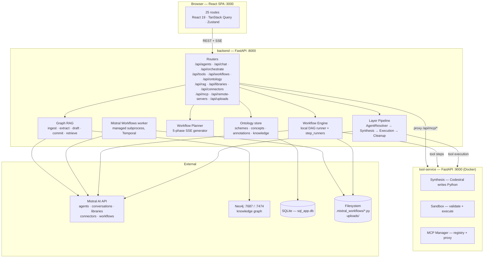
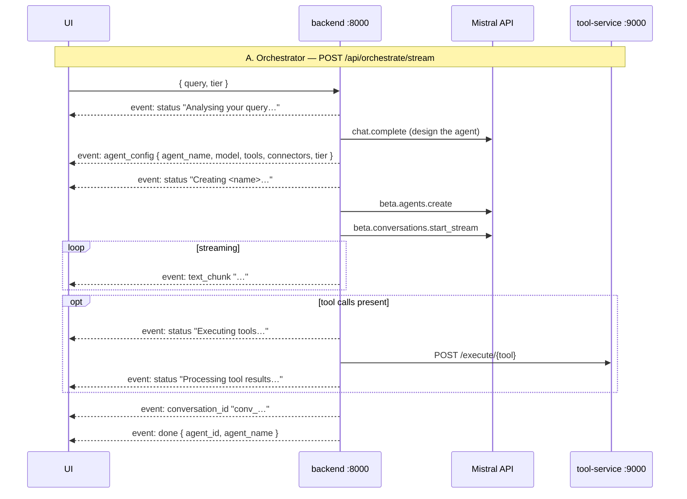
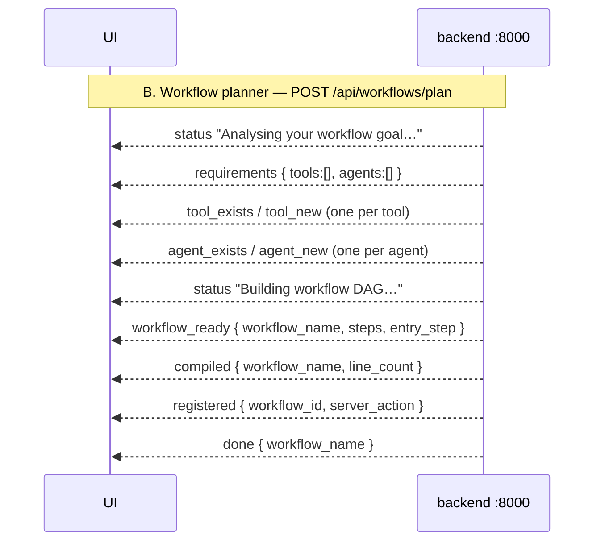
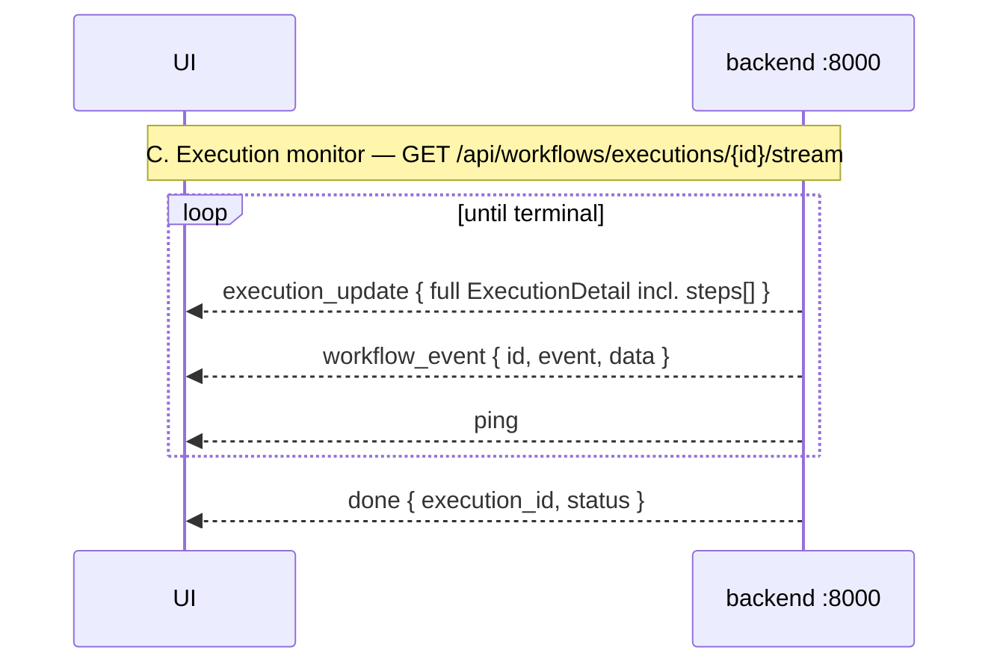

# Frontend Regeneration Spec — Agentic AI Design Patterns Platform

> **Audience:** Lovable.ai (or any AI frontend generator).
> **Goal:** Rebuild the entire frontend of this platform with **identical functionality and identical API wiring**, but with a **better visual language, better component quality, and better information flow**.
> **Non-goal:** Changing the backend. The backend is fixed. Every endpoint, payload shape, query parameter, and SSE event name in this document is authoritative — match them exactly or the app will not work.

---

## 0. How to use this document

| Section | Use it for |
|---|---|
| §1 Product overview | Understanding what you are building |
| §2 Backend architecture image | Mental model of services + ports |
| §3 Connection contract | Base URLs, proxy, CORS, auth, error envelope |
| §4 Tech stack | What is required vs. what you may replace |
| §5 Design system | Colours, typography, motion — the part you should *improve* |
| §6 App shell & routes | Navigation structure |
| §7 Page-by-page spec | The 25 screens, each with its API calls |
| §8 Full API reference | Every endpoint, grouped |
| §9 SSE streaming contracts | The four live-streaming surfaces |
| §10 Shared TypeScript models | Copy these verbatim |
| §11 Cross-cutting UX rules | Loading/empty/error/optimistic patterns |
| §12 Acceptance checklist | Definition of done |

**Rule of thumb:** anything in a `code block` is a contract — reproduce it exactly.
Anything in prose about *look and feel* is an invitation to do better than the current build.

---

## 1. Product overview

**Agentic AI Design Patterns** is a control plane for building, running and observing AI agent systems on top of Mistral AI. It has six functional pillars:

1. **Orchestration** — the user types a goal; the backend analyses it, auto-designs an agent (name, model, tools, connectors, tier), creates it, and streams the answer back live.
2. **Agents** — full CRUD over persistent Mistral agents, including completion parameters, attached tools, connectors, document libraries, ontology domain tags, and a per-agent chat.
3. **Dynamic tools** — the platform *writes new Python tools at runtime* using Codestral, sandbox-validates them, holds them for approval, and can publish them to MCP servers or push them to remote runners.
4. **Workflows** — multi-step agent DAGs, authored two ways (AI planner via SSE, or a visual drag-and-drop builder), compiled to Mistral Workflows SDK Python, published to Mistral, then executed and observed with live traces, spans, logs and step timelines.
5. **Ontology** — a SKOS-lite controlled vocabulary (schemes → concepts → annotations) that scopes planners, facets palettes, validates workflows, and carries curated industry knowledge.
6. **Graph RAG** — documents uploaded to Mistral libraries, entity/relation extraction into a Neo4j knowledge graph with a human review step, and a hybrid retrieval surface with a query optimiser.

The current UI works but is visually dated: flat dark cards, inconsistent spacing, dense tables, weak hierarchy, ad-hoc modals. **Your job is to keep every one of these behaviours and make the presentation excellent.**

---

## 2. Backend architecture image

### 2.1 Service topology



### 2.2 ASCII fallback (same picture)

```
                        ┌──────────────────────────────────────────┐
                        │  React SPA  :3000                        │
                        │  25 routes · Query · Zustand · XYFlow    │
                        └───────────────┬──────────────────────────┘
                                        │  REST (/api/**) + SSE
                                        ▼
   ┌────────────────────────────────────────────────────────────────────────┐
   │  backend — FastAPI  :8000        prefix = /api      health = /health   │
   ├────────────────────────────────────────────────────────────────────────┤
   │ agents │ conversations │ chat │ orchestrate │ tools │ uploads          │
   │ libraries │ remote-servers │ connectors │ ontology │ rag               │
   │ workflows │ workflows/executions                                       │
   ├────────────────────────────────────────────────────────────────────────┤
   │ Layer pipeline    AgentResolver → Synthesis → Execution → Cleanup      │
   │ Workflow engine   local DAG runner  ·  step_runners  ·  validation     │
   │ Workflow planner  5-phase SSE       ·  compiler → *.py                 │
   │ Ontology          schemes/concepts/annotations/knowledge  (SQLite)     │
   │ Graph RAG         ingest → extract → draft → commit → retrieve         │
   │ Worker subprocess mistral_worker.py  (Temporal, task queue "default")  │
   └───┬──────────────────┬─────────────────┬──────────────────┬────────────┘
       │                  │                 │                  │
       ▼                  ▼                 ▼                  ▼
 ┌───────────┐    ┌──────────────┐   ┌────────────┐   ┌──────────────────┐
 │tool-service│   │ Mistral API  │   │  Neo4j     │   │ SQLite + FS       │
 │  :9000     │   │ (cloud)      │   │ :7687/:7474│   │ sql_app.db        │
 │ synthesis  │   │ agents       │   │ entities   │   │ uploads/          │
 │ sandbox    │   │ conversations│   │ relations  │   │ .mistral_workflows│
 │ MCP mgr    │   │ libraries    │   └────────────┘   └──────────────────┘
 └───────────┘    │ connectors   │
                  │ workflows    │
                  └──────────────┘
```

### 2.3 The three live surfaces







### 2.4 Data-store map (which screen reads what)

```
Mistral cloud ──── agents, conversations, libraries + documents,
                   connectors + credentials, registered workflows, executions
SQLite ─────────── remote_servers, ontology (schemes/concepts/annotations/knowledge),
                   rag (documents/drafts/timeline)
Neo4j ──────────── entities, relations (graph RAG)
Filesystem ─────── .mistral_workflows/workflow_*.py (compiled), uploads/*.png
tool-service DB ── dynamic tools (code, hash, status, sandbox output), MCP registry
```

---

## 3. Connection contract

### 3.1 Base URL and dev proxy

The frontend calls **relative paths**. All requests go through the dev-server proxy.

```ts
// vite.config.ts — REQUIRED
export default defineConfig({
  server: {
    port: 3000,
    proxy: {
      '/api':     'http://localhost:8000',
      '/health':  'http://localhost:8000',
      '/uploads': 'http://localhost:8000',
    },
  },
});
```

```ts
// api/client.ts — REQUIRED shape
import axios from 'axios';

export const api = axios.create({
  baseURL: '',                 // relative — the proxy handles it
  timeout: 420_000,            // 7 min: synthesis + planning are slow
  headers: { 'Content-Type': 'application/json' },
});

api.interceptors.request.use((config) => {
  const token = localStorage.getItem('auth_token');
  if (token) config.headers.Authorization = `Bearer ${token}`;
  return config;
});

api.interceptors.response.use(
  (res) => res,
  (err) => {
    const msg = err.response?.data?.detail ?? err.response?.data?.message ?? err.message;
    console.error('[API Error]', msg);
    return Promise.reject(err);
  },
);
```

- **API prefix:** every endpoint below is under `/api`, except `GET /health` and static `/uploads/*`.
- **Auth:** there is **no auth on the backend**. The `Authorization` header is forwarded if `localStorage.auth_token` exists, but nothing requires it. **Do not build a login screen.**
- **CORS:** the backend allows `http://localhost:3000` and `http://localhost:5173` by default (`CORS_ORIGINS` env var).
- **Long timeouts matter:** tool synthesis, workflow planning and RAG extraction routinely take 60–300 s. Never set a 30 s timeout.

### 3.2 Error envelope

Two shapes exist. Handle both.

```jsonc
// FastAPI HTTPException
{ "detail": "Workflow 'x' not found" }

// Custom handlers (MistralAPIError, AgentNotFound, ToolServiceError, WorkflowError)
{ "error": "mistral_api_error", "message": "...", "details": { } }
```

Status codes in use: `200`, `201`, `400`, `403` (protected agent delete), `404`, `409` (name already taken), `422` (invalid definition), `500`, `502` (upstream Mistral), `503` (tool-service down).

Some endpoints return **`200` with an `{ "error": "..." }` body** instead of an HTTP error — notably `DELETE /api/tools/{id}` for native/builtin tools and several `/api/remote-servers/*` routes. **Always check for an `error` key in a 200 body.**

### 3.3 Degradation rules — build the UI to survive these

| Dependency down | Symptom | Required UI behaviour |
|---|---|---|
| tool-service `:9000` | `/health` → `docker_tool_service: "unreachable"`; `/api/tools` returns only native + builtin | Warning banner on the Tools page; the rest of the app stays usable |
| Neo4j | `/api/rag/status` → `{ graph: { available: false, reason } }` | Graph RAG tab shows an inline "graph offline" state with the reason and the `docker compose up -d neo4j` hint |
| Mistral Workflows worker | `register` / `publish` returns `server_action: "pending_worker"` | This is **not an error** — show "waiting for the worker to register" |
| Mistral executions API | `/api/workflows/executions` → `remote_available: false` | Show only local runs plus a subtle "remote executions unavailable" note |
| Any list endpoint 5xx | — | Inline error card with a retry button; never a blank page |

---

## 4. Tech stack

### Required (contract-bearing)

| Concern | Library | Why it is required |
|---|---|---|
| Data fetching / cache | `@tanstack/react-query` v5 | Query-key invalidation patterns are baked into the flows |
| HTTP | `axios` | Interceptor + timeout contract above |
| Routing | `react-router-dom` v7 | The route table in §6 is part of the spec (deep links, `?execId=`) |
| Graph canvas | `@xyflow/react` v12 + `dagre` | Workflow builder, workflow visualizer, ontology graph, knowledge graph |
| Local state | `zustand` (+ `persist`) | Chat sessions persist to `localStorage` key `mistral-chat-sessions` |
| Markdown | `react-markdown` + `remark-gfm` | All assistant output is markdown |
| Code display | `react-syntax-highlighter` (Prism) | Tool source, compiled workflow Python, JSON results |
| Icons | `lucide-react` | — |
| Animation | `framer-motion` | Wrap the app in `<MotionConfig reducedMotion="user">` |

### Free to improve

Styling system (Tailwind v4 currently), component primitives (introduce shadcn/ui, Radix, or your own), layout composition, charts library, toast/notification system, form library. **Please do introduce a real component library** — the current build hand-rolls every modal, tab, dropdown and table.

---

## 5. Design system

### 5.1 Current tokens — the starting point, not the ceiling

```css
@theme {
  --font-display: 'Inter', sans-serif;
  --font-mono: 'JetBrains Mono', monospace;

  --color-bg-base:    #06090F;
  --color-bg-surface: rgba(15, 20, 28, 0.6);
  --color-bg-hover:   rgba(30, 37, 50, 0.8);

  --color-text-primary:   #F8FAFC;
  --color-text-secondary: #CBD5E1;
  --color-text-muted:     #94A3B8;

  --color-border-subtle: #2A3441;
  --color-border-focus:  #6366F1;

  --color-accent-blue:    #3B82F6;
  --color-accent-purple:  #8B5CF6;
  --color-accent-pink:    #EC4899;
  --color-accent-cyan:    #06B6D4;
  --color-accent-coral:   #FF5C35;
  --color-accent-success: #10B981;
  --color-accent-warning: #F59E0B;
  --color-accent-danger:  #EF4444;
}
```

Utility classes referenced throughout the current code — reimplement or replace, but keep the *visual roles*: `.surface-card`, `.vibrant-bg`, `.ambient-orb` (+ `-primary` / `-secondary` / `-accent`), `.text-gradient-vibrant`, `.btn-primary`, `.btn-secondary`, `.minimal-input`, `.custom-scrollbar`.

### 5.2 Semantic colour assignments — must stay consistent

**Agent tiers** — used on agent cards, workflow nodes, orchestrator output, builder palette:

| Tier key | Label | Colour | Icon |
|---|---|---|---|
| `foundation` | Foundation | `#a5b4fc` indigo | 🛡️ |
| `domain` | Domain | `#fbbf24` amber | 🏢 |
| `use_case` | Use-Case | `#34d399` emerald | 🎯 |

Display default when unset = `foundation`; the orchestrator's default *selection* is `domain`. **Do not hardcode the list** — fetch it from `GET /api/ontology/tiers`, which returns `{ tiers: [{ value, label, description }] }`. Use the table above only for colour/icon mapping.

**Execution statuses** — one identity per state, used in badges, timelines, waterfalls, tables:

| Status | Semantics | Suggested colour |
|---|---|---|
| `PENDING` | queued | slate / muted |
| `RUNNING` | active (animate) | blue, pulsing |
| `RETRYING_AFTER_ERROR` | active, degraded | amber, pulsing |
| `COMPLETED` | terminal success | emerald |
| `FAILED` | terminal error | red |
| `CANCELLED` | terminal, user-stopped | slate |
| `TERMINATED` | terminal, hard-stopped | orange |
| `TIMED_OUT` | terminal | orange |
| `CONTINUED_AS_NEW` | terminal, handed off | purple |

**Step types** — builder palette, canvas nodes, inspector, visualizer:

| Type | Meaning | Suggested identity |
|---|---|---|
| `agent` | run a Mistral agent | purple, Cpu icon |
| `tool` | call a registered tool | blue, Wrench icon |
| `connector` | call a Mistral connector tool | cyan, Plug icon |
| `condition` | branch on an expression | amber, GitBranch icon |
| `transform` | reshape variables with Python | emerald, Code icon |

**Tool sources** — `builtin` (Mistral native capability), `native` (hardcoded backend tool), `dynamic` (Codestral-synthesised). Badge each distinctly; **only `dynamic` tools are editable and deletable** (ids prefixed `native-` / `builtin-` are read-only and the API rejects mutations on them).

### 5.3 Visual direction — what to improve

Functionality is fixed; these are the presentation goals:

1. **Hierarchy.** Current pages are flat walls of equal-weight cards. Introduce a real type scale, section headers (eyebrow / title / description), and clear primary-action placement.
2. **Density control.** Executions, tools, annotations and RAG documents are all list-heavy. Provide comfortable/compact density and real table semantics — sticky headers, column alignment, hairline separators.
3. **Live-ness.** Four surfaces stream. Make "live" legible: connection-phase chips (`idle / connecting / live / reconnecting / closed / error`), animated step progress, elapsed-time tickers, an unmistakable terminal-state transition.
4. **Graph canvases.** Four separate canvases exist. Unify their controls (fit-view, layout-direction toggle, zoom, minimap, legend), node design language, and selection → inspector interaction.
5. **Empty and error states.** Every list has an empty state; most are one grey line today. Give each an icon, one sentence of explanation, and the primary action that resolves it.
6. **Motion with restraint.** Keep `framer-motion` layout transitions for the sidebar and route changes; drop decorative motion elsewhere. Respect `prefers-reduced-motion`.
7. **Theming.** The app is dark-only today. A light theme is welcome but optional; if added, drive it entirely from tokens.
8. **Responsiveness.** The sidebar already collapses at `md`. Builder and visualizer canvases must degrade to a usable read-only + inspector mode on narrow screens rather than breaking.

---

## 6. App shell and route table

### 6.1 Shell

```
┌────────────┬──────────────────────────────────────────────┐
│  Sidebar   │  <Outlet />                                  │
│  280px     │  scrollable, ambient background orbs         │
│  ↔ 72px    │                                              │
│  collapsed │                                              │
└────────────┴──────────────────────────────────────────────┘
```

- Brand: **"Agentic AI Design Patterns"**, sparkle mark.
- Sidebar collapses to 72 px (icon-only) via a chevron; animates with a spring.
- Below `md`, the sidebar becomes an overlay drawer with a scrim and a hamburger in a mobile top bar.
- Footer link: **API Docs ↗** → `/docs` (FastAPI Swagger), opens in a new tab.

### 6.2 Navigation items (order matters)

| Label | Path | Icon | Expandable |
|---|---|---|---|
| Orchestrator | `/` | BotMessageSquare | — |
| Playground | `/playground` | Terminal | ▸ lists persisted general chat sessions |
| Agents | `/agents` | Cpu | ▸ lists agents, each expanding to its own sessions |
| Tools | `/tools` | Wrench | — |
| Workflows | `/workflows` | GitBranch | — |
| Executions | `/executions` | Radio | — |
| Conversations | `/conversations` | MessageSquare | — |
| Connectors | `/connectors` | Plug | — |
| Ontology | `/ontology` | Network | — |
| MCP Servers | `/mcp` | Server | — |
| Libraries | `/libraries` | Library | — |
| Health | `/health` | Activity | — |

**Expandable behaviour (keep it):** Playground and Agents expand inline in the sidebar.
- Playground → "Chats" group, `+` creates a new general session, each row supports inline rename and delete on hover.
- Agents → "Active Agents" group (from `GET /api/agents?page=0&page_size=20`), each agent expands to its own "Sessions" sub-group with a `+` to create an agent-scoped session.
- Sessions live in `zustand` + `persist`, not on the server.

### 6.3 Full route table

```
/                                   OrchestratorChat
/playground                         GeneralChat
/agents                             AgentStudio
/agents/:id                         AgentDetail
/tools                              ToolLifecycle
/workflows                          WorkflowDashboard
/workflows/new                      WorkflowCreateChooser
/workflows/new/ai                   WorkflowPlanner
/workflows/new/visual               WorkflowBuilder
/workflows/archived                 ArchivedWorkflows
/workflows/executions               ExecutionsDashboard   ← declared BEFORE :workflowName
/executions                         ExecutionsDashboard   (alias)
/workflows/:workflowName            WorkflowVisualizer
/workflows/:workflowName/edit       WorkflowBuilder
/workflows/:workflowName/execute    WorkflowExecutionPage  (?execId=<id> deep-link)
/conversations                      ConversationManager
/ontology                           ConceptBrowser  (6 tabs)
/connectors                         ConnectorRegistry
/connectors/:id                     ConnectorDetail
/mcp                                McpRegistry  (2 tabs)
/mcp/:serverName                    McpServerDetail
/remote-servers/:id                 RemoteServerDetail
/libraries                          LibraryManager
/health                             HealthDashboard
*                                   NotFound
```

**Route-order requirement:** `/workflows/executions` must be registered before `/workflows/:workflowName`, or "executions" is parsed as a workflow name.

---

## 7. Page-by-page specification

Each entry lists: **purpose → layout → API calls → states → interaction rules → improvement notes.**

---

### 7.1 `/` — Orchestrator (OrchestratorChat)

**Purpose.** The hero screen. The user describes a goal in natural language; the backend designs and creates an agent on the fly and streams the answer.

**Layout.** Centred single column. Empty state = large brand headline + prompt composer. Once submitted, a **vertical timeline** of steps renders above the streaming answer.

**Composer.**
- Auto-resizing textarea (max 120 px), Enter submits, Shift+Enter newlines.
- **Tier selector** dropdown to the left of the send button; default `domain`. Options from `GET /api/ontology/tiers`; colour/icon from §5.2. Closes on outside click.
- Send button disabled while `isProcessing`.

**API.**
```
POST /api/orchestrate/stream        (SSE)   body: { query, tier }
```

**SSE event handling (exact):**

| Event | Payload | UI action |
|---|---|---|
| `status` | plain string | Mark the previous timeline step `completed`; push a new `active` step with this label |
| `agent_config` | JSON `{ agent_name, model, tools[], connectors[], tier }` | Push a rich card: agent name, model chip, tier badge, "Equipped Tools" chip row, connector chips |
| `text_chunk` | plain text | Append to the streaming answer buffer, render as markdown live |
| `conversation_id` | string | Store (enables follow-ups) |
| `error` | string | Push an error step, stop |
| `done` | JSON `{ agent_id, agent_name }` | Capture `agent_id` and reveal a **"Generate Agent →"** CTA that navigates to `/agents/{agent_id}` |

**Rendering.** Markdown via `react-markdown` + `remark-gfm`; fenced code via Prism (`vscDarkPlus` today — pick a better theme). Auto-scroll to the bottom on every step/chunk.

**Improvement notes.** The timeline is the identity of this screen — make it excellent: connector lines, per-step spinners that resolve to checkmarks, a subtle "thinking" shimmer during long gaps between events, and a collapsible "how this agent was designed" summary once done.

---

### 7.2 `/playground` — General Chat

**Purpose.** Raw chat-completions playground, bypassing the orchestrator.

**Layout.** Two panes: message list (left/main) + a **"Chat Settings"** panel (right, collapsible).

**Settings panel.**
- **Model** select — `mistral-large-latest`, `mistral-medium-latest`, `mistral-small-latest`, `open-mistral-nemo` (the backend also accepts the aliases `default-large-latest`, `default-medium-latest`, `default-small-latest`, `open-default-nemo` and maps them).
- **Enable Safe Prompt** toggle → `safe_prompt` boolean.
- Header label: *Playground (Chat Completions)* / *Standard Chat*.

**Attachments.** Paperclip → `POST /api/uploads/image` (JPG/PNG/WebP/GIF, max 20 MB). Tooltip text: `Attach image (JPG, PNG, WebP, GIF — max 20MB)`. On success show an image thumbnail chip in the composer; send `image_base64` + `image_mime` with the message content.

**API.**
```
POST /api/chat/stream               (SSE)   body: ChatCompletionRequest
POST /api/uploads/image             (multipart, field name "file")
```
SSE events here are only `text_chunk`, `done`, `error`.

**Sessions.** Backed by `useSessionStore` (`type: 'general'`). New sessions come from the sidebar `+`. Session title auto-derives from the first 30 chars of the first user message.

---

### 7.3 `/agents` — Agent Studio

**Purpose.** Grid of all agents + creation.

**Layout.** Page header "**Agent Studio**" / *Create and manage specialized AI agents.* → search field (`Search agents…`) → responsive card grid.

**Agent card.** Name, model chip, description (or *No description provided*), **tier badge**, **domain chips** (ontology `serves_domain` annotations), an "Industry knowledge" indicator when the knowledge tool is attached, and a delete action. Clicking the card → `/agents/{id}`.

**Create modal — "Create New Agent".** Fields: `Name` (`e.g. Code Reviewer`), `Description` (`Brief description of the agent's purpose`), `Model` select, `Tier` select (Foundation / Domain / Use Case), `System Instructions` textarea (`You are a helpful assistant that…`). Actions: Cancel / Create.

**API.**
```
GET    /api/agents?page=0&page_size=20
POST   /api/agents            { name, model, instructions, description, tier, tools[],
                                document_library_ids[], connectors[] }
DELETE /api/agents/{id}
POST   /api/ontology/annotations/bulk   { subject_type: "agent", subject_ids: [...] }
```
Use the bulk annotations call once per page load to badge every card in a single round trip. Deleting an agent flagged `protected: true` returns **403** — hide the delete control for those (currently only the RAG query optimiser).

**Empty state.** *No agents found* + a primary "Create New Agent" action.

**Improvement notes.** Add sort (name / created), filter by tier and by domain, and a skeleton grid while loading rather than a spinner.

---

### 7.4 `/agents/:id` — Agent Detail

**Purpose.** The deepest screen: inspect, tune, and chat with one agent.

**Layout.** Split view — **chat on the left/main**, **configuration inspector on the right** (or a tabbed layout; your call, but both must be reachable without navigation).

**Configuration inspector sections.**
1. **Agent Configuration** — `Name`, `Description`, `Model`, `Instructions` (textarea), `Tier`, `Use Case`, `Domain` (ontology annotation editor).
2. **Completion Parameters** — sliders/inputs, each with the exact end labels used today:
   - `Temperature` — *Precise* ⟷ *Creative*
   - `Top P` — *Focused* ⟷ *Diverse*
   - `Max Tokens` — placeholder `Default (model limit)`
   - `Random Seed` — placeholder `None (random)`
   - `Frequency Penalty`, `Presence Penalty`
3. **Tools Equipped** — chip list; empty state *No tools equipped.*
4. **Connectors** — chip list; empty state *No connectors attached.*

All edits are **PATCH-on-save** (do not auto-save on every keystroke).

**Chat.** Same streaming behaviour as the Playground but bound to this agent; supports image attachment. Sessions are `type: 'agent'` + `agentId`, persisted, and listed under the agent in the sidebar.

**API.**
```
GET    /api/agents/{id}
PATCH  /api/agents/{id}                 (only changed fields; omit `connectors` to keep them,
                                         send [] to detach all)
GET    /api/agents?page=0&page_size=…   (for the sidebar/context)
POST   /api/orchestrate/stream          (SSE, with agent_id + conversation_id for follow-ups)
POST   /api/uploads/image
GET    /api/ontology/annotations/agent/{id}
PUT    /api/ontology/annotations        { subject_type, subject_id, predicate, concept_ids[] }
GET    /api/ontology/tiers
GET    /api/ontology/concepts?scheme=domain
```

**Follow-up rule.** Once a `conversation_id` exists for the session, send it with the next `POST /api/orchestrate/stream` — the backend then appends to the existing Mistral conversation instead of creating a new agent.

**Not found.** `Agent not found.` state with a link back to `/agents`.

---

### 7.5 `/tools` — Tool Lifecycle

**Purpose.** Synthesise, review, edit, publish and distribute dynamic tools.

**Layout.** Header "**Tool Lifecycle**" / *Synthesize, review, and manage dynamic tools.* Then **tabs**: `Active Tools` · `Pending Review`. A side panel holds the **Tool Synthesizer** and the **Remote Servers** / **MCP Servers** targets.

**Tool Synthesizer.** `Task Description` textarea (placeholder: `e.g. A function that fetches the weather for a given city.`) → Synthesize. This is a **long call (up to minutes)** — show determinate-feeling progress, not a 500 ms spinner. On success, toast *"Tool generated successfully and moved to the …"* and invalidate both tool lists. On failure show a **Synthesis Failed** panel with the error.

**Tool row / card.** Name, version, status badge, source badge (`dynamic` / `native` / `builtin`), description, and expandable detail with:
- **Tool Definition** — source code, Prism-highlighted, editable for dynamic tools.
- **Parameters Schema** — rendered from `schema_json`.
- Sandbox output when present.

**Actions.**
- Pending tools: **Approve** / **Reject**.
- Dynamic tools: **Edit** (source + description) → `PUT`, **Delete**.
- **Publish to MCP** — pick a server name.
- **Send to Remote Server** — pick a saved remote server; shows a **Remote Server Response** panel with the returned payload.

**Remote Servers panel.** List, **Add Server** form (`Server Name` = `e.g. my-remote-runner`, `Server URL` = `https://my-server.com/receive-tool`, `Description`), reachability **check** with badges *Reachable* / *Unreachable* / *Checking* / *Not checked*, and a **Server Health Info** disclosure. Empty state: *No remote servers configured.*

**Guided hint block (keep it).** The current UI explains the flow: *Navigate to … → Click … → Come back here and select your server to send the tool code.* Preserve this onboarding, presented better.

**API.**
```
GET    /api/tools                     → Tool[]  (dynamic + native-* + builtin-*)
GET    /api/tools/pending             → { tools: [], count }
POST   /api/tools/synthesize          { task }
POST   /api/tools/{id}/approve
POST   /api/tools/{id}/reject
PUT    /api/tools/{id}                { source_code, description }     (dynamic only)
DELETE /api/tools/{id}                                                  (dynamic only)
GET    /api/tools/by-hash/{hash}
POST   /api/tools/{id}/publish-mcp    { server_name }
GET    /api/remote-servers
POST   /api/remote-servers            { name, url, description }
POST   /api/remote-servers/check      { url }
POST   /api/remote-servers/{id}/send-tool  { tool_id }
DELETE /api/remote-servers/{id}
```

**Important:** `PUT`/`DELETE` on ids beginning `native-` or `builtin-` return `200` with `{ "error": "Cannot edit native or built-in tools." }`. Hide those controls up front.

---

### 7.6 `/workflows` — Workflow Dashboard

**Purpose.** Index of all workflows.

**Layout.** Header "**Workflows**" / *Design, execute, and monitor multi-agent pipelines.* Toolbar: Refresh, "New workflow" (→ `/workflows/new`), link to Archived.

**Workflow card.** Name, description, step count, entry step, source badge (`planner` / `builder`), deployment badge (`is_deployed`), and an **"unpublished changes"** indicator when `has_unpublished_changes` is true.

**Row actions (tooltips are the current copy — keep the meanings):**
- `Open in the visual builder` → `/workflows/{name}/edit`
- `Register on Mistral server` → `POST /api/workflows/{name}/register`
- `Archive Workflow` → `PUT /api/workflows/{name}/archive`
- Execute → `/workflows/{name}/execute`
- Inspect → `/workflows/{name}`
- `Refresh`

**API.**
```
GET  /api/workflows                       → { workflows: WorkflowDefinition[], count }
POST /api/workflows/{name}/register
PUT  /api/workflows/{name}/archive
```

**Empty state.** *No workflows yet* + both creation paths offered.

---

### 7.7 `/workflows/new` — Create Chooser

**Purpose.** Fork between the two authoring modes. Purely presentational — no API calls.

Two large option cards:

| Card | Tooltip | Sub-labels shown | Navigates to |
|---|---|---|---|
| AI planner | `Describe it` | *Tools attached to agents*, *Agents wired into a DAG*, *A publishable module* | `/workflows/new/ai` |
| Visual builder | `Build it visually` | — | `/workflows/new/visual` |

Both paths produce the same `WorkflowDefinition`, and either result can be reopened in the visual builder.

---

### 7.8 `/workflows/new/ai` — Workflow Planner

**Purpose.** Describe a goal in prose; watch the platform synthesise tools, create agents, build the DAG, compile it and register it — live.

**Layout.** Prompt composer at the top → a **phase timeline** below → a **Planning History** side panel.

**API.**
```
POST /api/workflows/plan     (SSE)   body: { goal }
GET  /api/agents             (context)
```

**SSE event handling (exact):**

| Event | Payload | UI |
|---|---|---|
| `status` | string | Advance the phase timeline |
| `requirements` | `{ tools: [], agents: [] }` | Render a plan preview: which tools and agents are needed |
| `tool_exists` | `{ tool_name, status: "exists" }` | Tool chip badged **Reused** |
| `tool_new` | `{ tool_name, status }` | Tool chip badged **Created** |
| `agent_exists` | agent info | Agent card badged **Reused** |
| `agent_new` | agent info | Agent card badged **Created**, with its **Equipped Tools** |
| `workflow_ready` | `{ workflow_name, steps, entry_step }` | DAG preview; show `Entry: <step>` |
| `compiled` | `{ workflow_name, line_count }` or `{ error }` | **Compiled to Workflows SDK** badge |
| `registered` | `{ workflow_id, server_action }` | **Registered on Workflow Server** or **Registration pending** |
| `fatal_error` | `{ error }` | Stop, show the failure prominently |
| `error` | string | Inline error |
| `done` | `{ workflow_name }` | Offer "Open workflow" / "Execute now" |

Also show a **None needed** state when no tools require synthesis, and a **Live** indicator while the stream is open.

**Planning History panel.** Persisted in `localStorage` under key `agent_planner_history`. Empty state: *No planning history yet. / Start planning a workflow to see its timeline here.*

**Improvement notes.** This is the most impressive flow in the product and currently the least polished. Treat it as a staged progress narrative with clear phase boundaries, per-phase durations, and a final summary card.

---

### 7.9 `/workflows/new/visual` and `/workflows/:workflowName/edit` — Workflow Builder

**Purpose.** Drag-and-drop DAG authoring.

**Layout — three columns + tabs.**

```
┌───────────┬──────────────────────────────┬───────────────┐
│  Palette  │  Canvas / Definition / Script │   Inspector   │
│  (left)   │  (tabs, centre)               │   (right)     │
└───────────┴──────────────────────────────┴───────────────┘
```

Tabs: `Canvas` · `Definition` (raw JSON) · `Script` (compiled Python).

**Palette (left).** Search field `Search agents and tools…`. Sections with these exact titles: `Agents`, `Tools`, `Connectors`, `Logic`. Logic contains `Condition` (*branch on an expression*) and `Transform` (*reshape variables*). Tool chips carry source badges `built-in` / `native` / `synth`. Header actions: `Refresh catalog`, `Create a new agent`, `Synthesise a new tool`. Agents can be faceted by **domain** using `catalog.domains`.

**Canvas.** `@xyflow/react` with `dagre` auto-layout. Node badges: `Entry step`, `This step has errors`, `This step has warnings`. Drag from the palette to add; connect handles to set `next_steps`.

**Inspector (right).** Sections change by selection:
- **Workflow** (nothing selected): `Name` (`loan_approval_flow`), `Description` (`What this workflow does`), `Workflow inputs` (the `input_schema` editor).
- **Identity**: `Step id`, `Description` (`What this step does`).
- **Execution**: `Tier`, `Parallel group` (`none`), `Continues to`.
- **Agent step**: `Bound agent`, `Prompt template`, `Tools`.
- **Tool step**: `Tool`, `Arguments`.
- **Connector step**: `Service`, `Tool`, `Arguments`, `Credentials` (`default`).
- **Condition step**: `Expression` — placeholder `{{credit_score}} > 700`.
- **Transform step**: `Transform code` — placeholder `{'decision': {{step_risk_output}}, 'reviewed': True}`.
- Actions: `Duplicate step`, `Delete step`.

**Script tab.** Prism-highlighted Python with `Copy to clipboard`, `Download .py`, `Recompile`. When the definition is invalid, show *Cannot compile yet* with the blocking issues.

**Create modals.** `Create agent` (`e.g. Risk Assessor`, `One line on what this agent is for`, tool picker with empty state *No tools available yet.*) and `Synthesise tool`.

**Validation.** Run `POST /api/workflows/validate` on change (debounced). It always returns **200** — issues are the payload, `severity` is `error` (blocks save/publish) or `warning` (advisory). Surface counts in a status bar and map each issue to its `step_id` on the canvas.

**Save vs. Publish — these are different actions:**
- **Save** = `POST /api/workflows` (new, `409` if the name is taken, `422` if invalid) or `PUT /api/workflows/{name}` (existing). Draft only.
- **Publish** = `POST /api/workflows/{name}/publish`. Compiles, writes the worker module, registers on Mistral, stamps `published_hash`. A `422` means ontology validation failed. `registration_pending: true` is a **success**, not an error.

**API.**
```
GET  /api/workflows/builder/catalog      → { agents, tools, connectors, domains, models, tiers }
GET  /api/workflows/{name}
POST /api/workflows/validate             { definition }
POST /api/workflows                      { definition }
PUT  /api/workflows/{name}               { definition }
POST /api/workflows/{name}/publish
GET  /api/workflows/{name}/script        → { workflow_name, code, line_count, stale }
POST /api/workflows/script/preview       { definition }
GET  /api/connectors/{id}/tools          (inspector, on connector selection)
POST /api/agents                         (create-agent modal)
POST /api/tools/synthesize               (synthesise-tool modal)
```

**`ui_layout` must round-trip.** Persist node coordinates in `definition.ui_layout` as `{ [stepId]: { x, y } }` so a graph reopens exactly as it was left. It is excluded from `semantic_hash`, so moving nodes does **not** mark the workflow as having unpublished changes.

---

### 7.10 `/workflows/:workflowName` — Workflow Visualizer

**Purpose.** Read-and-tune view of a saved workflow's DAG, with deeper per-node configuration than the builder inspector.

**Layout.** Full-bleed canvas + a right-hand node inspector. Canvas controls: `Fit View`, `Horizontal layout (Left-Right)`, `Vertical layout (Top-Bottom)`, `Open in the visual builder`.

**Node inspector sections (exact headings used today):**
- **Node Specification**
- **Agent Parameters** — `Temperature` (*Precise* ⟷ *Creative*), `Top P` (*Focused* ⟷ *Diverse*), `Max Tokens` (`Default`), `Random Seed` (`None (random)`), `Frequency Penalty`, `Presence Penalty`
- **Query / Instruction Prompt**
- **Compute Tier & Engine**
- **Execution Arguments Schema** — `Argument` rows
- **Attribute Variable Mappings** — `Source Variable` → `Target Attribute`, `Value Expression`
- **Conditional Formula Expression** + **Router Outcomes** (`YES` / `NO`)
- **Connections Directory**
- **Incoming Inputs (Parents)** — empty: *No parent steps (Entry step)*
- **Outgoing Outputs (Children)** — empty: *No child steps (Terminal node)*
- **Parallel group**

Node type labels: `Agent Node`, `Tool Execution`, `Conditional Router`, `Data Transform`.
Idle state: *Select a node to inspect and control execution paths*.
Missing agent: *Agent not found on server.*

**API.**
```
GET  /api/workflows/{name}
PUT  /api/workflows/{name}          { definition }     (save inspector edits)
POST /api/workflows/{name}/export                       (compile to Python on disk)
GET  /api/agents/{id}                                   (resolve bound agents)
```

---

### 7.11 `/workflows/:workflowName/execute` — Workflow Execution Page

**Purpose.** Launch a run and watch it live.

**Layout.** Header with `Back to workflows` and `Execution history`. Left: **input form** generated from `definition.input_schema` (`[{ name, type, description, required }]`). Right / below: the **ExecutionMonitor**.

**Launch.** `POST /api/workflows/{name}/execute` with `{ input: {...}, wait_for_result: false }`. The response carries `execution_id`, `status`, and `source: "mistral" | "local"`. Immediately push `?execId=<id>` into the URL so the run is deep-linkable, then open the SSE stream.

**Deep link.** On mount, if `?execId=` is present, skip the form and attach the monitor to that execution.

**Attachments.** `Attach an image` → `POST /api/uploads/image`; show an *Image attached* chip.

**Conversational workflows.** When the running workflow expects chat input, show a composer that sends
`POST /api/workflows/executions/{id}/signals` with `{ name: "user_message", input: {...} }`.
The default handler name is `user_message` — send it explicitly.

**ExecutionMonitor — tabs (exact set).** `Steps` · `Result` · `Logs` · `Events` · `Trace` · `History` · `Control`.

Phase chip in the header: `Idle` · `Connecting` · `Live` · `Reconnecting` · `Closed` · `Disconnected`.
Idle body: *Awaiting execution*.

| Tab | Content | Source |
|---|---|---|
| **Steps** | Vertical timeline: step id/name, status, duration, input/output previews, parallel-group grouping | `execution_update.steps[]` from the stream |
| **Result** | Final `result`, JSON-formatted / markdown-aware | `execution_update.result` |
| **Logs** | Console with `Filter lines…`, `Copy visible lines`, `Download as .log`, level colouring | `GET .../logs?limit&since` — poll with `since = next_seq` |
| **Events** | Custom events the workflow published. Empty: *No events recorded yet.* | `workflow_event` frames |
| **Trace** | Span waterfall from the span tree | `GET .../trace/summary` |
| **History** | Raw Temporal history | `GET .../history?decode_payloads=true` |
| **Control** | Signal / Query / Update forms (`handler name`, JSON input), plus Cancel, Terminate, Reset (`event id`) | `POST .../signals`, `/queries`, `/updates`, `/cancel`, `/terminate`, `/reset` |

**Streaming hook contract (reimplement faithfully).**
```ts
useExecutionStream(executionId: string | null) => {
  detail, steps, events, logs, phase, error, finalStatus, reconnect
}
// - Consumes GET /api/workflows/executions/{id}/stream via fetch-streaming.
// - Retries with backoff, MAX_RETRIES = 6, but ONLY while non-terminal.
// - Caps: MAX_EVENTS = 500, MAX_LOGS = 2000.
// - A null id keeps the hook inert.
// - `done` frame sets finalStatus and stops reconnection permanently.
```

**API.**
```
GET  /api/workflows/{name}
POST /api/workflows/{name}/execute            { input, wait_for_result, timeout_seconds?, execution_id? }
GET  /api/workflows/executions/{id}?with_steps=true
GET  /api/workflows/executions/{id}/stream    (SSE)
POST /api/workflows/executions/{id}/signals   { name, input }
POST /api/uploads/image
```

---

### 7.12 `/executions` and `/workflows/executions` — Executions Dashboard

**Purpose.** Fleet view of every run, local and remote, merged.

**Layout.** Header "**Executions**". Filter bar: search (`Search by workflow or execution id…`), status filter, workflow filter, page size. Then a table.

**Columns.** `Execution` · `Workflow` · `Status` · `Started` · `Duration` · `Runtime` (the `source` field: `mistral` | `local`).

**Selection + batch actions.** Row checkboxes → **Cancel selected** / **Terminate selected**.
```
POST /api/workflows/executions/cancel      { execution_ids: [...] }
POST /api/workflows/executions/terminate   { execution_ids: [...] }
```
Both `422` on an empty array — disable the buttons when nothing is selected.

**Pagination.** Cursor-based: pass the previous response's `next_page_token`.

**API.**
```
GET /api/workflows/executions?workflow_identifier=&status=&search=&user_id=
                             &page_size=50&next_page_token=
    → { executions[], next_page_token, count, remote_available }
```

**Empty state.** *No executions match this view.*
When `remote_available === false`, show a non-blocking note that only local runs are listed.

**Formatting helpers (keep the behaviour).**
```ts
formatDuration(ms)      // <1s → "812ms" | <60s → "4.2s" | <60m → "3m 12s" | else "2h 5m"
executionDuration(exec) // prefers total_duration_ms; otherwise ticks against now() while running
formatTimestamp(iso)    // toLocaleString(), "—" when null
isTerminal(status) / isActive(status)
```

---

### 7.13 `/workflows/archived` — Archived Workflows

Header + `Refresh`. Lists archived workflows with an **Unarchive** action.
Empty: *No archived workflows / Archived workflows will appear here.*

```
GET /api/workflows            (filter client-side on `archived === true`)
PUT /api/workflows/{name}/unarchive
```

---

### 7.14 Workflow History Panel (shared component)

Slide-over used by the dashboard and the execution page. Header *Execution history*, search `Search executions…`, a metrics strip with four tiles — `Runs`, `OK`, `Errors`, `Avg` — and the run list with batch cancel/terminate.

```
GET  /api/workflows/{name}/metrics?start_time=&end_time=
     → { execution_count, success_count, error_count, average_latency_ms,
         latency_over_time, retry_rate, available, detail }
GET  /api/workflows/executions?workflow_identifier={name}
POST /api/workflows/executions/cancel
POST /api/workflows/executions/terminate
```
When `available: false`, show the tiles as "—" with the `detail` string as a tooltip. Empty: *No executions found.*

---

### 7.15 `/conversations` — Conversation Manager

Header "**Conversations**" / *View and manage conversation threads.*
List of Mistral conversations; expanding one loads its history (user/assistant/tool entries). Delete per row.
Empty: *No conversations found*.

```
GET    /api/conversations
GET    /api/conversations/{id}
GET    /api/conversations/{id}/history
DELETE /api/conversations/{id}
```

---

### 7.16 `/ontology` — Concept Browser (6 tabs)

**Purpose.** The vocabulary and knowledge hub.

**Tabs (exact):** `Overview` · `Vocabulary` · `Annotations` · `Knowledge` · `Scope preview` · `Graph RAG`.

Shared empty state: *No vocabulary loaded.*

```
GET /api/ontology     → { seeded, counts:{schemes,concepts,annotations},
                          schemes[], predicates[], subject_types[], level_names[] }
```

---

#### 7.16.1 Overview tab

A knowledge-graph canvas of the whole ontology. Sub-filters: `Everything` · `Taxonomy` · `Resources`. Search `Find anything, then Enter…`. Controls `Expand every level` / `Collapse back to industries`.

```
GET /api/ontology/graph?kinds=&scheme=&root_concept=&subject_type=&search=
                        &include_orphans=&hops=
    → { nodes[], edges[], counts{}, totals{}, kinds[], predicates[] }
```
`kinds` is a **single comma-separated string**, not a repeated param.

Edges carry `reveal: 'forward' | 'reverse'` for progressive disclosure — `forward` means the source reveals the target (hierarchy, composition), `reverse` means the target reveals the source (annotations point resource → concept). Honour this when expanding nodes. Concept nodes carry `rollup` (resources at or below, by subject type) and `rollup_total` — surface them on the node.

---

#### 7.16.2 Vocabulary tab

CRUD over schemes and concepts. Search `Search terms and synonyms…`. Concept id placeholder: `domain.bfsi.banking`. Row actions: `Add a child concept`, `Edit`, `Delete`.

**Before deleting**, call `conceptUsage` and show exactly what a cascade would take (children + annotation count + affected subjects), then require the `cascade` flag explicitly.

```
GET    /api/ontology/schemes
POST   /api/ontology/schemes                    { id, label, description }
PATCH  /api/ontology/schemes/{id}               { label?, description? }
DELETE /api/ontology/schemes/{id}?cascade=false
GET    /api/ontology/concepts?scheme=
POST   /api/ontology/concepts                   { id, scheme_id, label, parent_id?,
                                                  definition?, synonyms[] }
PATCH  /api/ontology/concepts/{id}              { label?, parent_id?, definition?,
                                                  synonyms[], clear_parent? }
DELETE /api/ontology/concepts/{id}?cascade=false
GET    /api/ontology/concepts/{id}/usage        → { concept_id, children[], annotations, subjects[] }
GET    /api/ontology/concepts/{id}/descendants
```

Domain concepts carry `level` and `level_name` (`industry` | `domain` | `subdomain`) — render the hierarchy with those labels.

---

#### 7.16.3 Annotations tab

Bind resources to concepts. Search `Find an agent…`, plus a toggle `Show only agents with no annotations`. Per subject, an editor grouped by predicate. Also offers **Auto-classify** (an LLM pass that writes the result when `subject_type` + `subject_id` are supplied).

**Predicate → scheme mapping (required):**

| Predicate | Label | Concept scheme |
|---|---|---|
| `has_tier` | Tier | `agent_tier` |
| `serves_domain` | Serves domain | `domain` |
| `handles_data_class` | Handles data | `data_class` |
| `requires_capability` | Requires capability | `capability` |
| `provides_capability` | Provides capability | `capability` |
| `egresses_to` | Sends data to | `data_class` |

Subject types: `agent` · `tool` · `connector` · `workflow` · `library`.

```
GET    /api/ontology/annotations?subject_type=&predicate=&concept_id=&source=&limit=500
POST   /api/ontology/annotations/bulk       { subject_type, subject_ids[] }
GET    /api/ontology/annotations/{subject_type}/{subject_id}
PUT    /api/ontology/annotations            { subject_type, subject_id, predicate,
                                              concept_ids[], source? }   ← replaces the whole set
POST   /api/ontology/annotations/one        { subject_type, subject_id, predicate, concept_id }
DELETE /api/ontology/annotations/one?subject_type=&subject_id=&predicate=&concept_id=
DELETE /api/ontology/annotations/{subject_type}/{subject_id}      ← clears the subject
POST   /api/ontology/classify               { name, description?, instructions?,
                                              subject_kind?, subject_type?, subject_id? }
    → { classified, result: { domains[], requires_capability[], provides_capability[],
                              data_classes[], tier, reasoning }, written?, detail? }
```
Show `result.reasoning` — it is the explanation users need to trust the classification.

---

#### 7.16.4 Knowledge tab

Curated industry knowledge that agents retrieve at runtime.

- **Search**: `Ask what an agent would ask, then press Enter…` — rehearses exactly what the agent tool would retrieve, and returns a `rendered` string (the literal text handed to the model). Show both the structured hits and the rendered block.
- **Add industry knowledge** form: title (`e.g. Affordability stress testing`), body, `concept_id`, `kind`, `tags` (`comma separated — the words someone would search for`), and `as_of` (tooltip: `When this content was last known good`).
- Domain filter includes an **Every industry** option.
- Row action: `Delete this entry`.
- **Attach knowledge tool** — reconciles every agent against knowledge coverage; returns `{ checked, attached, detached, unchanged, failed }`. Report those counts back to the user.

```
GET    /api/ontology/knowledge?concept_id=&kind=&limit=500  → { entries[], count, kinds[] }
GET    /api/ontology/knowledge/search?query=&domains=&kind=&limit=5
       → { query, domains[], results[], count, rendered }
POST   /api/ontology/knowledge      { concept_id, title, body, kind?, tags[] }
DELETE /api/ontology/knowledge/{id}
GET    /api/ontology/knowledge/agent/{agent_id}?query=
       → { agent_id, domains[], scoped, results[], count }
POST   /api/ontology/knowledge/attach-tool
```

---

#### 7.16.5 Scope preview tab

Input: `Describe a workflow goal…`. Shows what the planner would narrow that goal to — matched domains, scores, and a scoped subgraph.

```
GET /api/ontology/scope?goal=…        → { goal, scoped, domains[], label, concepts[], scores[[id,score]] }
GET /api/ontology/scope/graph?goal=…  → OntologyGraph + { scoped, label, matched_domains[], goal }
```
Both require `goal` with `min_length=3` — disable submit below that.

---

#### 7.16.6 Graph RAG tab

The largest sub-surface. **Sub-tabs:** `Libraries` · `Graph` · `Test retrieval` · `Timeline`.

**Libraries sub-tab.**
- Library cards with counts: `document_count`, `tracked_documents`, `graphed_documents`, `pending_documents`, `failed_documents`, `entities`, `relations`, `has_rules`. Filter `All libraries`.
- **Extraction rules** editor per library (free-text instructions guiding entity extraction), seeded with `default_instructions` and the known `entity_types`.
- Document upload (multipart: `file`, `rules`, `auto_extract`).
- Document rows show `status` — one of `uploaded` · `indexing` · `extracted` · `extracting` · `proposed` · `graphed` · `unsupported` · `failed` — plus `char_count`, `chunk_count`, and `in_library`. Row actions: `Show the graph this document contributed`, `Show what happened, stage by stage`, re-extract, delete.
- **Draft review** — the human gate before anything reaches the graph. Editable entity list (name, type, description, aliases, confidence, mentions with verbatim quotes) and relation list (source → predicate → target, evidence, confidence). Entity action tooltip: `Remove this entity and any relation that uses it` — deleting an entity must drop its relations, and `saveDraft` returns `dropped_relations` to confirm how many went. Then **Commit** writes to Neo4j and returns `{ entities, relations, orphans_removed, trace_id }`.
- Empty states: *No document libraries yet.* / *No documents in this library.*

**Graph sub-tab.** Neo4j snapshot canvas, scoped to `all` / `library` / `document`. Nodes carry `type`, `description`, `degree`, `confidence`; edges carry `predicate`, `evidence`, `doc_id`, `confidence`. Honour `truncated: true` with a visible "showing first N" notice. When `available: false`, render the offline state with the `reason`.

**Test retrieval sub-tab.** Query box: `Ask the graph — e.g. which suppliers is Contoso bound to?`. Optional library scoping, `hops`, `limit`, and an `optimize` toggle. Results show, in order: the **QueryPlan** (original vs. `rewritten`, `sub_queries`, `entity_hints`, `intent`, `backend`, `cached`), matched **entities**, retrieved **relations** (with hop count and evidence), **passages** (verbatim quotes with filename and chunk index), and the **`rendered`** block — literally what the agent's tool hands the model.

**Optimiser panel.** Status (`agent_id`, `name`, `model`, `backend`, `toolkit_available`, `protected`, `cached_queries`), an **Ensure** action (with `reset`), and a **Preview** that returns a `QueryPlan` for one query without searching.

**Timeline sub-tab.** Trace list (newest first) → per-trace stage tree. Each `TimelineEvent` has `parent_id`, so render it as a tree, with `stage`, `status` (`running` / `ok` / `failed` / `skipped`), `duration_ms`, `message`, `meta`. Live-follow a running trace over SSE. Empty: *No processing runs yet.*

```
GET    /api/rag/status                                   → { graph: GraphStatus }
GET    /api/rag/overview                                 → { libraries[], graph, totals, entity_types[] }
GET    /api/rag/libraries/{library_id}/documents         → { library_id, documents[], rules, count }
POST   /api/rag/libraries/{library_id}/documents         (multipart: file, rules, auto_extract)
POST   /api/rag/documents/{id}/extract                   { rules?: string|null }
DELETE /api/rag/documents/{id}?drop_from_library=true
GET    /api/rag/libraries/{library_id}/rules             → { rules, default_instructions, entity_types[] }
PUT    /api/rag/libraries/{library_id}/rules             { rules }
GET    /api/rag/documents/{id}/draft                     → { document, draft|null }
PUT    /api/rag/documents/{id}/draft                     { entities[], relations[] }
                                                          → { draft, dropped_relations }
POST   /api/rag/documents/{id}/commit                    → { status, document_id, trace_id,
                                                              entities, relations, orphans_removed }
GET    /api/rag/graph?library_id=&document_id=&limit=    → GraphSnapshot
POST   /api/rag/search                                   { query, library_ids[], hops, limit, optimize }
GET    /api/rag/optimizer
POST   /api/rag/optimizer/ensure?reset=false
POST   /api/rag/optimizer/preview                        { query }  → QueryPlan
GET    /api/rag/timeline?subject=&scope=&limit=25        → { traces[] }
GET    /api/rag/timeline/{trace_id}                      → { trace_id, events[] }
GET    /api/rag/timeline/{trace_id}/stream               (SSE)
```

---

### 7.17 `/connectors` — Connector Registry

**Purpose.** Mistral Connectors — MCP servers registered *with Mistral*, which holds their credentials and runs their tools. **Distinct from `/mcp`**; the two registries share no state. Say so in the UI.

**Layout.** Header + search `Search connectors…` + `New Connector` + card grid.

**Connector card.** Icon (`icon_url`), name/title, description, protocol, visibility chip (`Organisation` / `Workspace` / `Private`; the API may also return `shared_global` for directory connectors), `is_directory` badge, `is_authenticated` badge, `active` toggle state, `tool_count`. Action: `Delete connector` (directory connectors are read-only).

**Create form.** `name` (`github_app` — alphanumeric, dashes/underscores, 64 chars max), `description` (`Read and write GitHub issues and pull requests.`), `server` (`https://mcp.example.com/sse`), optional `icon_url`, `system_prompt`, `visibility`, `headers`, `auth_data { client_id, client_secret }`.

```
GET    /api/connectors?page_size=200&cursor=   → { items[], count, next_cursor }
POST   /api/connectors
DELETE /api/connectors/{id}
```
Error state: *Could not load connectors.*

---

### 7.18 `/connectors/:id` — Connector Detail

Sections: overview, **Tools**, **Authentication**, **Credentials**, **Activation**.

- **Tools** — list with parameters; each has a **test** action that invokes the tool and shows both the raw `result` and the flattened `output`.
- **Authentication** — supported methods; **Get auth URL** starts an OAuth2 flow. **The URL is short-lived: fetch it on click, never cache it.** Open it in a new tab.
- **Credentials** — scoped `organization` | `workspace` | `user` (default `user`). Add named credentials (`name` / `token` inputs; body is a free-form dict e.g. `{"bearer_token": "..."}`), mark default, delete one or all at a scope.
- **Activation** — enable/disable at a scope (default `organization`) with `include` / `exclude` / `requires_confirmation` / `skip_confirmation` tool filters.

```
GET    /api/connectors/{id}
PATCH  /api/connectors/{id}                       { name?, description?, icon_url?,
                                                    system_prompt?, connection_config? }
GET    /api/connectors/{id}/tools                 → { tools[], count }
POST   /api/connectors/{id}/tools/{tool}/call     { arguments, credentials_name? }
                                                  → { result, output }
GET    /api/connectors/{id}/authentication
GET    /api/connectors/{id}/auth-url?credentials_name=   → { auth_url, ttl }
GET    /api/connectors/{id}/credentials?scope=user       → { credentials[], scope, count }
POST   /api/connectors/{id}/credentials?scope=user       { name, credentials{}, is_default }
DELETE /api/connectors/{id}/credentials?scope=user&credentials_name=
POST   /api/connectors/{id}/activation?scope=organization
       { active, include[], exclude[], requires_confirmation[], skip_confirmation[] }
```
Not found: *Connector not found.*

---

### 7.19 `/mcp` — MCP Registry (2 tabs)

**Tabs:** `MCP Servers` · `Remote Servers`.

**MCP Servers tab.** Header *Connect, manage, and test Model Context Protocol servers.* Cards show health (`Healthy` / `Disconnected` / `Unreachable` / `Checking` / `Not checked`) and a **Server Health Info** disclosure. Actions: disconnect, reconnect, delete, open detail. Register form: `Server Name` (`e.g. github-mcp`), `Endpoint URL` (`https://mcp.example.com`), `Description` (`What does this server provide?`). Bulk **health check** pings every server. Empty: *No MCP servers registered*.

**Remote Servers tab.** Custom code-push targets. Add form: `Server Name` (`e.g. my-remote-runner`), `Server URL` (`https://my-server.com/receive-tool`), `Description` (`What does this server do?`). Reachability check with the same badge vocabulary. Empty: *No remote servers configured*.

```
GET    /api/mcp/servers
POST   /api/mcp/servers                         { name, url, description, ... }
DELETE /api/mcp/servers/{name}
POST   /api/mcp/servers/{name}/disconnect
POST   /api/mcp/servers/{name}/reconnect
GET    /api/mcp/servers/{name}/tools
POST   /api/mcp/health-check
GET    /api/remote-servers
POST   /api/remote-servers                      { name, url, description }
GET    /api/remote-servers/{id}
PUT    /api/remote-servers/{id}                 { name?, url?, description? }
DELETE /api/remote-servers/{id}
POST   /api/remote-servers/check                { url }   → { reachable, url, health? }
```

---

### 7.20 `/mcp/:serverName` — MCP Server Detail

**Tabs:** `Tools` · `Test Playground`.
*Execute MCP tools with custom arguments and inspect results.*
Fields: `Select Tool`, `Input Schema` (read-only, from the tool), `Arguments (JSON)` editor, `Result` panel.
Empty: *No tools discovered*.

```
GET  /api/mcp/servers
GET  /api/mcp/servers/{name}/tools
POST /api/mcp/execute/{server}/{tool}      { arguments: {...} }
```

---

### 7.21 `/remote-servers/:id` — Remote Server Detail

Editable `Server Name`, `Server URL`, `Description`; reachability check; a list of tools deployed to this server (*Deployed dynamically*, empty: *No tools deployed*); and a tool picker (`Choose a tool...`) to push code.
States: *Remote Server not found.* with `Return to Registry`; *Server is unreachable*.

```
GET  /api/remote-servers/{id}
PUT  /api/remote-servers/{id}
POST /api/remote-servers/check              { url }
POST /api/remote-servers/{id}/send-tool     { tool_id }
GET  /api/tools                             (tool picker)
```
`send-tool` returns either `{ status: "sent", server_name, tool_name, remote_status_code, remote_response }` or `{ status: "error", message }` — both with HTTP 200. Render both distinctly.

---

### 7.22 `/libraries` — Library Manager

**Purpose.** Mistral document libraries — the RAG corpus agents can search.

Header "**Libraries**" / *Create a document library to enable RAG for your agents.* Search `Search libraries...`, filter `Filter`.

**Card.** Name, description (*No description provided*), document count, created date. Actions: open, `Rename Library`, `Share Library` (shows a **Library Link**), delete.

**Detail / drawer.** Document table with `Upload date`; drag-and-drop upload zone (*Drag and Drop files here* / *Drop files to upload*); `Add Webpage` (*Fetch and import a webpage as a document*, `URL` = `https://example.com/docs`) with the failure copy *Failed to fetch webpage. Check the URL and try again.*; per-document delete.

**Create modal — "Create New Library":** `Name` (`e.g. Product Documentation`), `Description` (`What kind of documents are in this library?`).

```
GET    /api/libraries                                → Library[]
POST   /api/libraries                                { name, description }
PUT    /api/libraries/{id}                           { name?, description? }
DELETE /api/libraries/{id}
GET    /api/libraries/{id}/documents                 → LibraryDocument[]
POST   /api/libraries/{id}/documents                 (multipart "file", 5 min timeout)
POST   /api/libraries/{id}/documents/webpage         { url }
DELETE /api/libraries/{id}/documents/{documentId}
```
Empty: *No libraries found*.
Note for users: library-backed RAG and graph RAG (§7.16.6) are two paths over the same upload.

---

### 7.23 `/health` — Health Dashboard

Header "**System Health**" / *Live status of all core microservices.*
Three service cards: **Orchestrator** (`:8000`), **Tool Service** (`:9000`), **Frontend**. Each shows `Status` and `Version`, with a pulsing dot when healthy and a solid red dot otherwise.

```
GET /health   → { status: "healthy", service: "mistral-dynamic-agent",
                  version: "2.0.0", docker_tool_service: "reachable" | "unreachable" }
```
Derive the Tool Service card from `docker_tool_service`. Poll every ~15 s. Add uptime/latency readouts if you like — but the three cards must remain.

---

### 7.24 `*` — Not Found

404 mark, "Page Not Found", *The page you are looking for does not exist or is under construction.*, and a link home.

---

## 8. Full API reference

Base: `http://localhost:8000`. Prefix `/api` unless noted.

### 8.1 Health

| Method | Path | Response |
|---|---|---|
| GET | `/health` *(no prefix)* | `{ status, service, version, docker_tool_service }` |

### 8.2 Agents

| Method | Path | Body / Query | Response |
|---|---|---|---|
| GET | `/api/agents` | `page=0`, `page_size=20` | `{ items[], page, page_size, total_pages, count }` |
| GET | `/api/agents/{id}` | — | `Agent` |
| POST | `/api/agents` | `{ name, model, instructions, description?, tier?, tools[], document_library_ids[]?, connectors[]? }` | `Agent` |
| PATCH | `/api/agents/{id}` | any subset of `{ name, model, instructions, description, tier, temperature, top_p, max_tokens, random_seed, frequency_penalty, presence_penalty, tools, document_library_ids, connectors }` | `Agent` |
| DELETE | `/api/agents/{id}` | — | `{ }` · **403** when `protected` |

`connectors[]` items: `{ connector_id, include?[], exclude?[], requires_confirmation?[] }`.
Omitting `connectors` on PATCH keeps them; sending `[]` detaches all.
`model` defaults to `mistral-large-latest`.

### 8.3 Conversations

| Method | Path |
|---|---|
| GET | `/api/conversations` |
| GET | `/api/conversations/{id}` |
| GET | `/api/conversations/{id}/history` |
| DELETE | `/api/conversations/{id}` |

### 8.4 Chat

| Method | Path | Notes |
|---|---|---|
| POST | `/api/chat/completions` | JSON response |
| POST | `/api/chat/stream` | SSE: `text_chunk`, `done`, `error` |

```jsonc
// ChatCompletionRequest
{
  "model": "mistral-large-latest",
  "messages": [{ "role": "user", "content": "…", "name": null,
                 "tool_call_id": null, "tool_calls": null }],
  "agent_id": null, "temperature": null, "top_p": null, "max_tokens": null,
  "stream": false, "stop": null, "random_seed": null,
  "tools": null, "tool_choice": null, "response_format": null,
  "safe_prompt": false, "parallel_tool_calls": null
}
```

### 8.5 Orchestrator

| Method | Path | Body |
|---|---|---|
| POST | `/api/orchestrate` | `{ query, agent_id?, conversation_id?, cleanup_agent?, workflow?, tier?, image_base64?, image_mime? }` |
| POST | `/api/orchestrate/stream` | same body, SSE |

JSON response:
```jsonc
{ "response": "…", "conversation_id": "…", "agent_id": "…", "agent_name": "…",
  "agent_description": "…", "model": "…", "tools_used": [...],
  "temperature": 0.5, "is_followup": false }
```

### 8.6 Tools (proxied to tool-service :9000)

| Method | Path | Body / Notes |
|---|---|---|
| GET | `/api/tools` | array; dynamic + `native-*` + `builtin-*` |
| GET | `/api/tools/pending` | `{ tools[], count }` |
| POST | `/api/tools/synthesize` | `{ task }` — **slow** |
| POST | `/api/tools/{id}/approve` | — |
| POST | `/api/tools/{id}/reject` | — |
| PUT | `/api/tools/{id}` | `{ source_code, description }` — dynamic only |
| DELETE | `/api/tools/{id}` | dynamic only |
| GET | `/api/tools/by-hash/{hash}` | SHA-256 lookup |
| POST | `/api/tools/{id}/publish-mcp` | `{ server_name }` |

Tool object: `{ id, name, version, status, description, schema_json, source_code, hash?, sandbox_output?, mcp_published?, mcp_server_name?, created_at? }`.

### 8.7 MCP (proxied)

| Method | Path | Body |
|---|---|---|
| GET | `/api/mcp/servers` | — |
| POST | `/api/mcp/servers` | server config |
| DELETE | `/api/mcp/servers/{name}` | — |
| POST | `/api/mcp/servers/{name}/disconnect` | — |
| POST | `/api/mcp/servers/{name}/reconnect` | — |
| GET | `/api/mcp/servers/{name}/tools` | — |
| POST | `/api/mcp/execute/{server}/{tool}` | `{ arguments: {} }` |
| POST | `/api/mcp/health-check` | — |

### 8.8 Remote servers

| Method | Path | Body |
|---|---|---|
| GET | `/api/remote-servers` | — |
| POST | `/api/remote-servers` | `{ name, url, description }` |
| GET | `/api/remote-servers/{id}` | — |
| PUT | `/api/remote-servers/{id}` | `{ name?, url?, description? }` |
| DELETE | `/api/remote-servers/{id}` | — |
| POST | `/api/remote-servers/check` | `{ url }` → `{ reachable, url, health? }` |
| POST | `/api/remote-servers/{id}/send-tool` | `{ tool_id }` |

### 8.9 Uploads

| Method | Path | Notes |
|---|---|---|
| POST | `/api/uploads/image` | multipart, field `file`. Allowed: `image/jpeg`, `image/png`, `image/webp`, `image/gif`. Max **20 MB**. |

Response: `{ filename, content_type, size_bytes, image_base64, image_url, image_mime }`.
`image_url` is served statically at `/uploads/{filename}`.

### 8.10 Libraries

| Method | Path | Body |
|---|---|---|
| GET | `/api/libraries` | — |
| POST | `/api/libraries` | `{ name, description }` |
| PUT | `/api/libraries/{id}` | `{ name?, description? }` |
| DELETE | `/api/libraries/{id}` | — |
| GET | `/api/libraries/{id}/documents` | — |
| POST | `/api/libraries/{id}/documents` | multipart `file` |
| POST | `/api/libraries/{id}/documents/webpage` | `{ url }` |
| DELETE | `/api/libraries/{id}/documents/{docId}` | — |

### 8.11 Connectors

See §7.17–7.18. Query params: `page_size` (default 200), `cursor`; `scope` on credentials (`organization` \| `workspace` \| `user`, default `user`) and activation (default `organization`).

### 8.12 Ontology

See §7.16. Full route list:

```
GET    /api/ontology
GET    /api/ontology/tiers
GET    /api/ontology/schemes
POST   /api/ontology/schemes
PATCH  /api/ontology/schemes/{id}
DELETE /api/ontology/schemes/{id}?cascade=
GET    /api/ontology/concepts?scheme=
POST   /api/ontology/concepts
PATCH  /api/ontology/concepts/{id}
DELETE /api/ontology/concepts/{id}?cascade=
GET    /api/ontology/concepts/{id}/descendants
GET    /api/ontology/concepts/{id}/usage
GET    /api/ontology/annotations?subject_type=&predicate=&concept_id=&source=&limit=
POST   /api/ontology/annotations/bulk
GET    /api/ontology/annotations/{subject_type}/{subject_id}
PUT    /api/ontology/annotations
POST   /api/ontology/annotations/one
DELETE /api/ontology/annotations/one?subject_type=&subject_id=&predicate=&concept_id=
DELETE /api/ontology/annotations/{subject_type}/{subject_id}
GET    /api/ontology/graph?kinds=&scheme=&root_concept=&subject_type=&search=&include_orphans=&hops=
GET    /api/ontology/scope?goal=
GET    /api/ontology/scope/graph?goal=
POST   /api/ontology/classify
GET    /api/ontology/knowledge?concept_id=&kind=&limit=
GET    /api/ontology/knowledge/search?query=&domains=&kind=&limit=
POST   /api/ontology/knowledge
DELETE /api/ontology/knowledge/{id}
GET    /api/ontology/knowledge/agent/{agent_id}?query=
POST   /api/ontology/knowledge/attach-tool
```

### 8.13 Workflows

```
POST   /api/workflows/plan                     (SSE)  { goal }
GET    /api/workflows                          → { workflows[], count }
POST   /api/workflows                          { definition }   409 / 422
GET    /api/workflows/{name}
PUT    /api/workflows/{name}                   { definition }
POST   /api/workflows/validate                 { definition }   always 200
POST   /api/workflows/script/preview           { definition }
GET    /api/workflows/{name}/script            → { workflow_name, code, line_count, stale }
POST   /api/workflows/{name}/publish           → { …registration, message, registration_pending,
                                                    published_hash, has_unpublished_changes, warnings[] }
POST   /api/workflows/{name}/register          → { …, server_action: updated|registered|pending_worker|error }
POST   /api/workflows/{name}/export            (legacy: compile to disk)
GET    /api/workflows/builder/catalog          → BuilderCatalog
PUT    /api/workflows/{name}/archive
PUT    /api/workflows/{name}/unarchive
POST   /api/workflows/{name}/execute           { input, wait_for_result, timeout_seconds?, execution_id? }
GET    /api/workflows/{name}/executions
GET    /api/workflows/{name}/metrics?start_time=&end_time=
```

### 8.14 Workflow executions

```
GET  /api/workflows/executions?workflow_identifier=&status=&search=&user_id=
                              &page_size=50&next_page_token=
POST /api/workflows/executions/cancel          { execution_ids[] }
POST /api/workflows/executions/terminate       { execution_ids[] }
GET  /api/workflows/executions/{id}?with_steps=true
GET  /api/workflows/executions/{id}/steps?include_internal=false
GET  /api/workflows/executions/{id}/history?decode_payloads=true
GET  /api/workflows/executions/{id}/trace/info
GET  /api/workflows/executions/{id}/trace/summary
GET  /api/workflows/executions/{id}/trace/events?merge_same_id_events=true&include_internal_events=false
GET  /api/workflows/executions/{id}/trace/otel
GET  /api/workflows/executions/{id}/logs?limit=500&since=0
GET  /api/workflows/executions/{id}/stream     (SSE)
POST /api/workflows/executions/{id}/signals    { name, input }
POST /api/workflows/executions/{id}/queries    { name, input }
POST /api/workflows/executions/{id}/updates    { name, input }
POST /api/workflows/executions/{id}/cancel
POST /api/workflows/executions/{id}/terminate
POST /api/workflows/executions/{id}/reset      { event_id, reason?, exclude_signals?, exclude_updates? }
```

### 8.15 Graph RAG

See §7.16.6 for the full list.

---

## 9. SSE streaming contracts

### 9.1 Wire format

All streams use `text/event-stream` with:
```
event: <name>
data: <payload>
<blank line>
```
Multi-line JSON payloads repeat the `data: ` prefix on each line — **your parser must join them with `\n` before `JSON.parse`.** Reuse this parser (it is proven against all four streams):

```ts
export interface SSEEvent { type: string; data: string }

export function createSSEStream(
  url: string,
  body: object,
  onEvent: (e: SSEEvent) => void,
  onDone?: () => void,
  signal?: AbortSignal,
): () => void {
  const ctrl = new AbortController();
  const sig = signal ?? ctrl.signal;

  (async () => {
    const res = await fetch(url, {
      method: 'POST',
      headers: { 'Content-Type': 'application/json' },
      body: JSON.stringify(body),
      signal: sig,
    });
    const reader = res.body?.getReader();
    if (!reader) return;
    const decoder = new TextDecoder();

    let buffer = '';
    let eventType = 'message';
    let dataBuffer: string[] = [];

    for (;;) {
      const { done, value } = await reader.read();
      if (done) {
        if (dataBuffer.length) onEvent({ type: eventType, data: dataBuffer.join('\n') });
        onDone?.();
        break;
      }
      buffer += decoder.decode(value, { stream: true });
      const lines = buffer.split('\n');
      buffer = lines.pop() ?? '';

      for (const raw of lines) {
        const line = raw.replace(/\r$/, '');
        if (line === '') {
          if (dataBuffer.length) { onEvent({ type: eventType, data: dataBuffer.join('\n') }); dataBuffer = []; }
          eventType = 'message';
        } else if (line.startsWith('event:')) {
          eventType = line.slice(6).trim();
        } else if (line.startsWith('data:')) {
          dataBuffer.push(line.startsWith('data: ') ? line.slice(6) : line.slice(5));
        }
      }
    }
  })().catch((e) => { if (e.name !== 'AbortError') console.error('SSE error', e); });

  return () => ctrl.abort();
}
```

`POST`-based streams (orchestrate, chat, plan) **cannot** use `EventSource` — use the fetch-reader above.
`GET`-based streams (execution stream, RAG timeline stream) may use `EventSource`, but fetch-streaming works for both and keeps one code path.

### 9.2 Event catalogue

| Stream | Method + path | Events |
|---|---|---|
| Orchestrator | `POST /api/orchestrate/stream` | `status`, `agent_config`, `text_chunk`, `conversation_id`, `error`, `done` |
| Chat | `POST /api/chat/stream` | `text_chunk`, `done`, `error` |
| Workflow planner | `POST /api/workflows/plan` | `status`, `requirements`, `tool_exists`, `tool_new`, `agent_exists`, `agent_new`, `workflow_ready`, `compiled`, `registered`, `fatal_error`, `error`, `done` |
| Execution monitor | `GET /api/workflows/executions/{id}/stream` | `execution_update`, `workflow_event`, `ping`, `error`, `done` |
| RAG timeline | `GET /api/rag/timeline/{trace_id}/stream` | `stage`, `ping`, `error`, `done` |

**Payload types.** `status`, `text_chunk`, `conversation_id` and `error` carry **plain strings** — do not `JSON.parse` them. Everything else carries JSON.

**Close signal.** `done` is always the close signal. Stop reconnecting after it.

**RAG timeline specifics.** Each stage arrives **twice** — once when it opens (`status: "running"`) and once when it closes (with `duration_ms`). De-duplicate on `(id, status, duration_ms)`, not on `id` alone, or stages spin forever. `ping` is a keep-alive. The stream self-terminates once nothing is running (~2 s tick, ~20 min cap).

**Execution stream specifics.** `execution_update` carries a **whole** `ExecutionDetail` including `steps[]` — replace state, do not merge. Retry with backoff, max 6 attempts, and **only while the execution is non-terminal**.

---

## 10. Shared TypeScript models

Copy these verbatim — they mirror the backend Pydantic models.

```ts
/* ── Agents ─────────────────────────────────────────────────────────── */
export interface Agent {
  id: string;
  name: string;
  model: string;
  description?: string;
  instructions?: string;
  tools?: unknown[];
  connectors?: ConnectorRef[];
  tier?: string;
  /** Platform-owned; DELETE returns 403. Hide the delete control. */
  protected?: boolean;
  created_at?: string;
  temperature?: number | null;
  top_p?: number | null;
  max_tokens?: number | null;
  random_seed?: number | null;
  frequency_penalty?: number | null;
  presence_penalty?: number | null;
}

export interface PaginatedAgents {
  items: Agent[]; page: number; page_size: number;
  total_pages: number; count: number;
}

/* ── Workflow definition ────────────────────────────────────────────── */
export type StepType = 'agent' | 'tool' | 'connector' | 'condition' | 'transform';
export type WorkflowSourceKind = 'planner' | 'builder';

export interface NodeLayout { x: number; y: number }

export interface WorkflowStep {
  id: string;
  type: StepType;
  tier?: string | null;
  /**
   * agent:     { agent_id, query_template } | { model, instructions }
   * tool:      { tool_name, arguments_template }
   * connector: { connector_id, connector_name, tool_name, arguments, credentials_name }
   * condition: { expression, true_step, false_step }
   * transform: { transform_code }
   */
  config: Record<string, unknown>;
  next_steps: string[];
  description?: string | null;
  /** Steps sharing a group id run concurrently. */
  parallel_group?: string | null;
}

export interface InputField {
  name: string; type: string; description?: string; required?: boolean;
}

export interface WorkflowDefinition {
  id?: string | null;
  name: string;
  description?: string | null;
  steps: WorkflowStep[];
  entry_step: string;
  input_schema: InputField[];
  variables: Record<string, unknown>;
  is_deployed: boolean;
  archived: boolean;
  source: WorkflowSourceKind;
  /** Canvas coordinates; excluded from the semantic hash. */
  ui_layout: Record<string, NodeLayout>;
  published_hash?: string | null;
  /** Server-computed: definition diverged from what is live on Mistral. */
  has_unpublished_changes?: boolean;
}

/* ── Validation ─────────────────────────────────────────────────────── */
export type IssueSeverity = 'error' | 'warning';
export interface ValidationIssue {
  severity: IssueSeverity; code: string; message: string;
  step_id?: string | null; field?: string | null;
}
export interface ValidationResult {
  valid: boolean; issues: ValidationIssue[];
  error_count: number; warning_count: number;
}

export interface ScriptResult {
  workflow_name: string; code: string; line_count: number;
  /** The file the worker loaded differs from this output. */
  stale: boolean;
}

/* ── Builder catalog ────────────────────────────────────────────────── */
export interface CatalogAgent {
  id: string; name: string; model: string;
  description?: string | null; tier?: string | null;
  tools: string[]; connectors: string[]; domains: string[];
}
export interface CatalogTool {
  name: string; description?: string | null;
  parameters: Record<string, { type?: string; description?: string }>;
  required: string[]; status: string;
  source: 'builtin' | 'native' | 'dynamic';
}
export interface CatalogConnector {
  id: string; name: string; description?: string | null; icon_url?: string | null;
  is_directory: boolean; is_authenticated: boolean; active: boolean;
  tools: CatalogTool[];
}
export interface CatalogDomain {
  id: string; label: string; parent_id?: string | null; agent_count: number;
}
export interface BuilderCatalog {
  agents: CatalogAgent[]; tools: CatalogTool[]; connectors: CatalogConnector[];
  domains: CatalogDomain[]; models: string[]; tiers: string[];
}

/* ── Executions ─────────────────────────────────────────────────────── */
export const EXECUTION_STATUSES = [
  'PENDING','RUNNING','RETRYING_AFTER_ERROR','COMPLETED','FAILED',
  'CANCELLED','TERMINATED','TIMED_OUT','CONTINUED_AS_NEW',
] as const;
export type ExecutionStatus = (typeof EXECUTION_STATUSES)[number];

export const TERMINAL_STATUSES: ReadonlySet<string> = new Set([
  'COMPLETED','FAILED','CANCELLED','TERMINATED','TIMED_OUT','CONTINUED_AS_NEW',
]);
export const ACTIVE_STATUSES: ReadonlySet<string> = new Set([
  'PENDING','RUNNING','RETRYING_AFTER_ERROR',
]);
export const isTerminal = (s?: string | null) => TERMINAL_STATUSES.has((s ?? '').toUpperCase());
export const isActive   = (s?: string | null) => ACTIVE_STATUSES.has((s ?? '').toUpperCase());

export interface ExecutionStep {
  id: string; name: string;
  /** RUNNING | COMPLETED | FAILED */
  status: string;
  start_time_ms?: number | null; end_time_ms?: number | null; duration_ms?: number | null;
  error?: string | null; internal?: boolean;
  attributes?: Record<string, unknown>;
  input_preview?: string | null; output_preview?: string | null;
  parallel_group?: string | null;
}

export interface ExecutionDetail {
  execution_id: string; workflow_name: string; status: string;
  start_time?: string | null; end_time?: string | null;
  result?: unknown; error?: string | null;
  root_execution_id?: string | null; parent_execution_id?: string | null;
  run_id?: string | null; user_id?: string | null; deployment_name?: string | null;
  total_duration_ms?: number | null;
  source: 'mistral' | 'local';
  steps: ExecutionStep[];
}

export interface ExecutionSummary {
  execution_id: string; workflow_name: string; status: string;
  start_time?: string | null; end_time?: string | null;
  total_duration_ms?: number | null; run_id?: string | null;
  root_execution_id?: string | null; parent_execution_id?: string | null;
  user_id?: string | null; source: 'mistral' | 'local';
}

export interface ExecutionListResponse {
  executions: ExecutionSummary[];
  next_page_token?: string | null;
  count: number;
  remote_available: boolean;
}

export interface TraceSpan {
  span_id: string; name: string;
  start_time_unix_nano: number; end_time_unix_nano?: number | null;
  attributes?: Record<string, unknown>;
  events?: Array<Record<string, unknown>>;
  children?: TraceSpan[] | null;
}
export interface TraceSummary {
  workflow_name?: string; execution_id?: string; status?: string;
  start_time?: string | null; end_time?: string | null;
  total_duration_ms?: number | null; span_tree?: TraceSpan | null;
}
export interface LogLine {
  seq: number; timestamp: string;
  level: 'DEBUG'|'INFO'|'WARNING'|'ERROR'|'CRITICAL'|string;
  logger: string; message: string; step_id?: string | null;
}
export interface ExecutionLogsResponse {
  execution_id: string; logs: LogLine[]; platform_logs: unknown[];
  next_seq: number; source: 'local' | 'mistral' | 'none'; detail?: string;
}
export interface WorkflowMetrics {
  execution_count?: number | null; success_count?: number | null;
  error_count?: number | null; average_latency_ms?: number | null;
  latency_over_time?: unknown; retry_rate?: number | null;
  available?: boolean; detail?: string;
}

/* ── Connectors ─────────────────────────────────────────────────────── */
export type ConnectorVisibility = 'shared_org' | 'shared_workspace' | 'private';
export type ConnectorScope = 'organization' | 'workspace' | 'user';

export interface Connector {
  id: string; name: string; title?: string; description: string;
  server?: string | null; icon_url?: string | null; system_prompt?: string | null;
  protocol: string;
  /** Read side may also return 'shared_global' for directory connectors. */
  visibility: ConnectorVisibility | string;
  is_directory: boolean; is_authenticated: boolean; active: boolean;
  auth_type?: string | null; supported_auth_methods: string[];
  tool_count?: number | null; created_at?: string; modified_at?: string;
}
export interface ConnectorTool {
  name: string; description: string;
  parameters: Record<string, unknown>; required: string[];
}
export interface ConnectorRef {
  connector_id: string;
  include?: string[]; exclude?: string[]; requires_confirmation?: string[];
}

/* ── Libraries ──────────────────────────────────────────────────────── */
export interface Library {
  id: string; name: string; description?: string;
  document_count?: number; created_at?: string;
}
export interface LibraryDocument {
  id: string; filename: string; size?: number;
  created_at?: string; mime_type?: string;
}

/* ── Ontology ───────────────────────────────────────────────────────── */
export type SchemeId = 'agent_tier' | 'domain' | 'capability' | 'data_class';
export type Predicate =
  | 'has_tier' | 'serves_domain' | 'handles_data_class'
  | 'requires_capability' | 'provides_capability' | 'egresses_to';
export type SubjectType = 'agent' | 'tool' | 'connector' | 'workflow' | 'library';

export interface ConceptScheme { id: string; label: string; description: string }
export interface Concept {
  id: string; scheme_id: string; parent_id: string | null;
  label: string; definition: string; synonyms: string[];
  level?: number;
  /** domain scheme only: industry | domain | subdomain */
  level_name?: string;
}
export type AnnotationMap = Partial<Record<Predicate, string[]>>;
export interface AnnotationRow {
  id: number; subject_type: string; subject_id: string;
  predicate: string; concept_id: string; source: string;
}
export interface ConceptUsage {
  concept_id: string; children: string[]; annotations: number;
  subjects: Array<{ subject_type: string; subject_id: string }>;
}
export interface ClassificationResult {
  domains: string[]; requires_capability: string[]; provides_capability: string[];
  data_classes: string[]; tier: string; reasoning: string;
}
export interface KnowledgeEntry {
  id: number; concept_id: string; kind: string; title: string; body: string;
  tags: string[]; as_of?: string | null; source: string; score?: number;
}
export interface TierOption { value: string; label: string; description: string }
export interface OntologyOverview {
  seeded: boolean;
  counts: { schemes: number; concepts: number; annotations: number };
  schemes: ConceptScheme[]; predicates: Predicate[]; subject_types: SubjectType[];
}

/* Ontology graph */
export interface OntologyGraphNode {
  id: string; kind: string; label: string; degree: number;
  scheme_id?: string; parent_id?: string | null; level?: number;
  definition?: string; synonyms?: string[];
  subject_id?: string; subject_type?: string;
  tier?: string; model?: string; status?: string; steps?: number;
  is_deployed?: boolean; archived?: boolean; description?: string;
  /** Concepts only: resources at or below this node, by subject type. */
  rollup?: Record<string, number>; rollup_total?: number;
}
export interface OntologyGraphEdge {
  id: string; source: string; target: string;
  kind: string; label: string; source_of?: string;
  /** forward: source reveals target. reverse: target reveals source. */
  reveal?: 'forward' | 'reverse';
}
export interface OntologyGraph {
  nodes: OntologyGraphNode[]; edges: OntologyGraphEdge[];
  counts: Record<string, number>;
  totals: { nodes: number; edges: number; concepts: number; annotations: number };
  kinds: string[]; predicates: string[];
  scoped?: boolean; label?: string; matched_domains?: string[]; goal?: string;
}

export const PREDICATE_LABELS: Record<Predicate, string> = {
  has_tier: 'Tier',
  serves_domain: 'Serves domain',
  handles_data_class: 'Handles data',
  requires_capability: 'Requires capability',
  provides_capability: 'Provides capability',
  egresses_to: 'Sends data to',
};
export const PREDICATE_SCHEME: Record<Predicate, SchemeId> = {
  has_tier: 'agent_tier',
  serves_domain: 'domain',
  handles_data_class: 'data_class',
  requires_capability: 'capability',
  provides_capability: 'capability',
  egresses_to: 'data_class',
};

/* ── Graph RAG ──────────────────────────────────────────────────────── */
export type DocumentStatus =
  | 'uploaded' | 'indexing' | 'extracted' | 'extracting'
  | 'proposed' | 'graphed' | 'unsupported' | 'failed';

export interface RagDocument {
  id: number; library_id: string; mistral_doc_id: string;
  filename: string; mime_type: string; status: DocumentStatus;
  error: string | null; char_count: number; chunk_count: number;
  rules: string; trace_id: string | null;
  created_at: string | null; updated_at: string | null;
  in_library?: boolean; size?: number;
}
export interface DraftEntity {
  name: string; normalized: string; type: string; description: string;
  aliases: string[]; confidence: number; source: string;
  mentions: { chunk_index: number; quote: string }[];
}
export interface DraftRelation {
  source: string; source_normalized: string; source_type: string;
  predicate: string;
  target: string; target_normalized: string; target_type: string;
  evidence: string; confidence: number; source_kind?: string;
}
export interface ExtractionDraft {
  id: number; document_id: number;
  status: 'pending' | 'edited' | 'committed';
  model: string | null; rules: string;
  entity_count: number; relation_count: number;
  entities: DraftEntity[]; relations: DraftRelation[];
  created_at: string | null; updated_at: string | null;
}
export interface LibraryCard {
  id: string; name: string; description: string;
  document_count: number; created_at: string;
  tracked_documents: number; graphed_documents: number;
  pending_documents: number; failed_documents: number;
  entities: number; relations: number; has_rules: boolean;
}
export interface GraphStatus {
  available: boolean; uri: string; database: string; reason: string | null;
}
export interface RagGraphNode {
  id: string; label: string; type: string; description: string;
  library_id: string | null; confidence: number | null; degree: number;
}
export interface RagGraphEdge {
  source: string; target: string; predicate: string; evidence: string;
  doc_id: string | null; confidence: number | null;
}
export interface GraphSnapshot {
  available: boolean; nodes: RagGraphNode[]; edges: RagGraphEdge[];
  truncated: boolean; scope: 'document' | 'library' | 'all';
  library_id: string | null; document_id: number | null;
}
export interface TimelineEvent {
  id: number; trace_id: string; parent_id: number | null;
  scope: 'ingest' | 'query'; subject: string; stage: string;
  status: 'running' | 'ok' | 'failed' | 'skipped';
  message: string | null; meta: Record<string, unknown>; seq: number;
  started_at: string | null; ended_at: string | null; duration_ms: number | null;
}
export interface TimelineTrace {
  trace_id: string; scope: 'ingest' | 'query'; subject: string;
  stages: number; failed: number; running: number; duration_ms: number;
  started_at: string | null; ended_at: string | null;
  root_stage: string | null; status: 'ok' | 'failed' | 'running';
}
export interface QueryPlan {
  query: string; rewritten: string; sub_queries: string[];
  entity_hints: string[]; intent: string; backend: string;
  agent_id?: string | null; reason?: string; cached?: boolean;
}
export interface MatchedEntity {
  name: string; normalized: string; type: string; description: string;
  aliases: string[]; library_id: string; confidence: number; score: number;
}
export interface RetrievedRelation {
  source_name: string; source_type: string;
  target_name: string; target_type: string;
  predicate: string; evidence: string; confidence: number;
  doc_id: string | null; filename: string | null;
  hops: number; score: number; sources: string[];
}
export interface SearchResult {
  plan: QueryPlan;
  entities: MatchedEntity[];
  relations: RetrievedRelation[];
  passages: { name: string; type: string; description: string;
              doc_id: string; filename: string; quote: string; chunk_index: number }[];
  available: boolean; reason: string;
  /** Exactly what the agent's tool hands the model. */
  rendered: string;
}

/* ── Uploads ────────────────────────────────────────────────────────── */
export interface UploadResult {
  filename: string; content_type: string; size_bytes: number;
  image_base64: string; image_url: string; image_mime: string;
}

/* ── Chat sessions (client-side only, persisted) ────────────────────── */
export interface Message {
  id: string;
  role: 'user' | 'assistant' | 'system' | 'tool';
  content: string;
  streaming?: boolean; timestamp?: string;
  imageUrl?: string; imageBase64?: string; imageMime?: string;
}
export interface ChatSession {
  id: string;
  type: 'general' | 'agent';
  agentId?: string | null;
  /** Mistral conversation id, once the first response arrives. */
  conversationId?: string | null;
  title: string;
  messages: Message[];
  updatedAt: number;
}
```

---

## 11. Cross-cutting UX rules

### 11.1 Query keys and cache

Reuse this key factory — invalidation across pages depends on the prefixes.

```ts
export const QK = {
  agents:          ()  => ['agents'] as const,
  /** Paged listings MUST key on page size, or two components with different
   *  sizes silently share one cache entry and the larger one renders truncated. */
  agentsPage:      (page: number, pageSize: number) => ['agents','page',page,pageSize] as const,
  agent:           (id: string) => ['agents', id] as const,
  conversations:   ()  => ['conversations'] as const,
  conversation:    (id: string) => ['conversations', id] as const,
  history:         (id: string) => ['conversations', id, 'history'] as const,
  workflows:       ()  => ['workflows'] as const,
  workflow:        (n: string) => ['workflows', n] as const,
  workflowScript:  (n: string) => ['workflows', n, 'script'] as const,
  builderCatalog:  ()  => ['workflows','builder','catalog'] as const,
  execution:       (id: string) => ['workflow-execution', id] as const,
  tools:           ()  => ['tools'] as const,
  pendingTools:    ()  => ['tools','pending'] as const,
  ontology:        ()  => ['ontology'] as const,
  ontologyTiers:   ()  => ['ontology','tiers'] as const,
  ontologyConcepts:(scheme = '') => ['ontology','concepts',scheme] as const,
  annotations:     (t: string, id: string) => ['ontology','annotations',t,id] as const,
  connectors:      ()  => ['connectors'] as const,
  connector:       (id: string) => ['connectors', id] as const,
  connectorTools:  (id: string) => ['connectors', id, 'tools'] as const,
  connectorCreds:  (id: string) => ['connectors', id, 'credentials'] as const,
  mcpServers:      ()  => ['mcp-servers'] as const,
  mcpServerTools:  (n: string) => ['mcp-servers', n, 'tools'] as const,
  remoteServers:   ()  => ['remote-servers'] as const,
  health:          ()  => ['health'] as const,
  libraries:       ()  => ['libraries'] as const,
  libraryDocs:     (id: string) => ['libraries', id, 'documents'] as const,
};
```

```ts
new QueryClient({
  defaultOptions: {
    queries: { staleTime: 60_000, gcTime: 300_000, retry: 2, refetchOnWindowFocus: false },
  },
});
```

**Invalidation map:**

| Mutation | Invalidate |
|---|---|
| create/update/delete agent | `QK.agents()` (prefix — reaches every page) |
| synthesize / approve / reject / edit / delete tool | `QK.tools()`, `QK.pendingTools()`, `QK.builderCatalog()` |
| create/update/publish workflow | `QK.workflows()`, `QK.workflow(name)`, `QK.workflowScript(name)` |
| archive/unarchive workflow | `QK.workflows()` |
| set annotations | `QK.annotations(type, id)`, `QK.ontology()`, and the owning list |
| concept/scheme CRUD | `QK.ontology()`, `QK.ontologyConcepts()` (prefix) |
| commit RAG draft | RAG overview, that library's documents, graph snapshot |
| connector credentials/activation | `QK.connector(id)`, `QK.connectorCreds(id)` |

### 11.2 Loading, empty, error

- **Loading:** skeletons matching final layout for lists/grids; inline spinners only for button-scoped actions. Never a full-page spinner on a route that has a stable chrome.
- **Empty:** icon + one-sentence explanation + the primary action that fills it. The exact copy used today is quoted per page in §7 — keep the meanings, improve the presentation.
- **Error:** inline card with the message from `detail` / `message` and a retry button. Never swallow an error into an empty state.
- **200-with-error bodies:** check for an `error` key before treating a 200 as success (see §3.2).

### 11.3 Long-running actions

`POST /api/tools/synthesize`, `POST /api/workflows/plan`, RAG extract/commit, and `publish` all take tens of seconds to minutes.

- Disable the trigger and show in-place progress with a description of the current phase.
- Never show an indeterminate spinner with no text for more than ~3 s.
- Keep the rest of the page interactive.
- Where an SSE stream exists (plan), drive progress from the events; where it does not (synthesize), show the elapsed time and a description of the pipeline stages.

### 11.4 Destructive actions

Require confirmation for: delete agent, delete tool, delete workflow/archive, delete library, delete document, delete connector, delete credentials, delete concept/scheme (**with cascade preview**), terminate execution, delete MCP/remote server, remove a draft entity (state that its relations go too).

### 11.5 Accessibility

Keyboard-reachable everything; focus rings on `--color-border-focus`; `aria-live="polite"` on streaming regions (announce status changes, not every text chunk); tab order in the builder must not trap; graph canvases need a non-canvas fallback listing (nodes as a list) for keyboard and screen-reader users.

### 11.6 Persistence

- Chat sessions → `localStorage['mistral-chat-sessions']` via `zustand/persist`.
- Planner history → `localStorage['agent_planner_history']`.
- Optional token → `localStorage['auth_token']`.
- Everything else is server state — do not cache it in `localStorage`.

---

## 12. Acceptance checklist

**Wiring**
- [ ] Vite proxies `/api`, `/health`, `/uploads` to `:8000`
- [ ] Axios timeout ≥ 420 s; both error envelopes handled; 200-with-`error` bodies handled
- [ ] No login screen; optional `auth_token` header pass-through only

**Streaming**
- [ ] Multi-line `data:` frames joined before `JSON.parse`
- [ ] All five streams consumed with the correct event names (§9.2)
- [ ] `status` / `text_chunk` / `conversation_id` / `error` treated as plain strings
- [ ] Execution stream retries only while non-terminal; caps at 6 retries / 500 events / 2000 logs
- [ ] RAG timeline de-duplicates on `(id, status, duration_ms)`

**Routes**
- [ ] All 25 routes present, including both `/executions` aliases
- [ ] `/workflows/executions` registered before `/workflows/:workflowName`
- [ ] `?execId=` deep-links into the execution monitor

**Behaviour**
- [ ] Orchestrator timeline renders every event type and reveals the agent CTA on `done`
- [ ] Agent PATCH omits `connectors` to keep them, sends `[]` to detach
- [ ] Protected agents show no delete control
- [ ] Native/builtin tools show no edit/delete controls
- [ ] Builder: Save and Publish are distinct; `422` surfaces validation issues; `pending_worker` is a success
- [ ] `ui_layout` round-trips; moving a node does not flag unpublished changes
- [ ] Tiers fetched from `/api/ontology/tiers`, never hardcoded
- [ ] Annotation predicates map to the correct concept schemes
- [ ] Concept deletion shows a cascade preview from `/usage` first
- [ ] RAG: draft review gates the commit; removing an entity drops its relations; `rendered` blocks shown verbatim
- [ ] Graph/Neo4j/tool-service/worker outages degrade per §3.3 without breaking the app

**Quality**
- [ ] Every list has a designed empty state, error state and skeleton
- [ ] Execution statuses, tiers, step types and tool sources use one consistent identity everywhere
- [ ] Four graph canvases share one control and node design language
- [ ] `prefers-reduced-motion` respected
- [ ] Sidebar collapse and mobile drawer work; canvases degrade gracefully on narrow screens

---

## Appendix A — Running the backend

```bash
# 1. Knowledge graph (optional — RAG degrades gracefully without it)
docker compose up -d neo4j            # bolt :7687, browser :7474

# 2. Tool service (optional — tools degrade to native + builtin without it)
cd tool-service && docker compose up -d        # :9000

# 3. Backend  (starts the Mistral Workflows worker as a subprocess)
cd backend && uvicorn app.main:app --reload    # :8000
#    Swagger: http://localhost:8000/docs

# 4. Frontend
cd frontend && npm run dev                     # :3000
```

Backend env vars that affect the frontend:

| Var | Default | Effect |
|---|---|---|
| `API_PREFIX` | `/api` | All route prefixes |
| `CORS_ORIGINS` | `http://localhost:3000,http://localhost:5173` | Allowed origins |
| `TOOL_SERVICE_URL` | `http://localhost:9000` | Tools/MCP availability |
| `NEO4J_URI` | `bolt://localhost:7687` | Graph RAG availability |
| `MISTRAL_WORKER_ENABLED` | `true` | Whether publish reaches `registered` or stays `pending_worker` |
| `DEPLOYMENT_NAME` | `default` | Worker task queue used on execute |

## Appendix B — Model names

Canonical: `mistral-large-latest`, `mistral-medium-latest`, `mistral-small-latest`, `open-mistral-nemo`, `codestral-latest`.
The backend also accepts and maps these aliases: `default-large-latest`, `default-medium-latest`, `default-small-latest`, `open-default-nemo`.
Prefer sourcing the model list from `GET /api/workflows/builder/catalog` → `models[]` rather than hardcoding.
