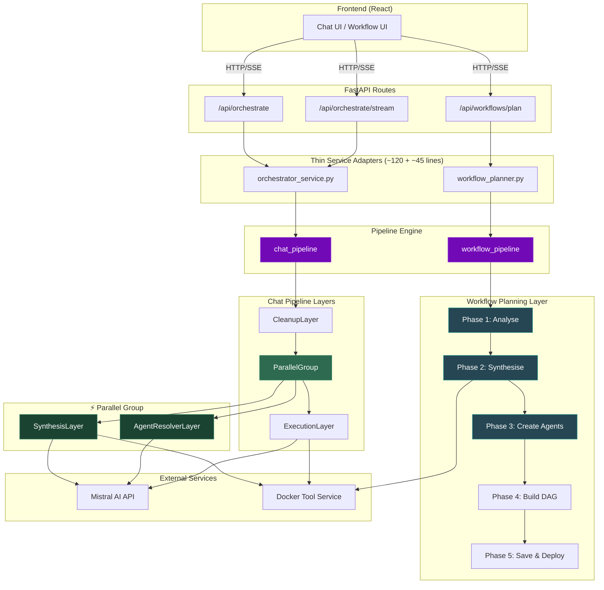
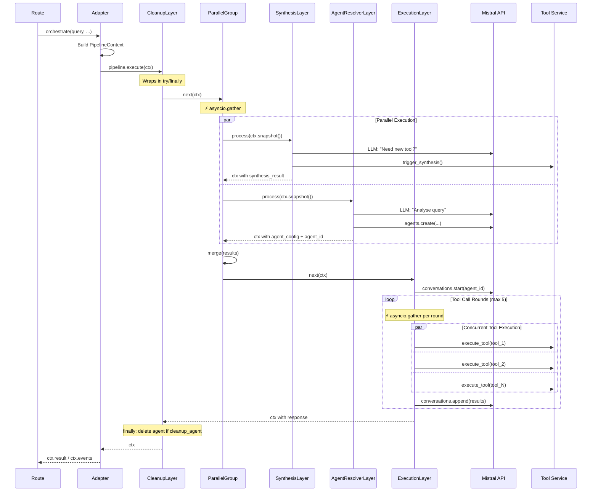
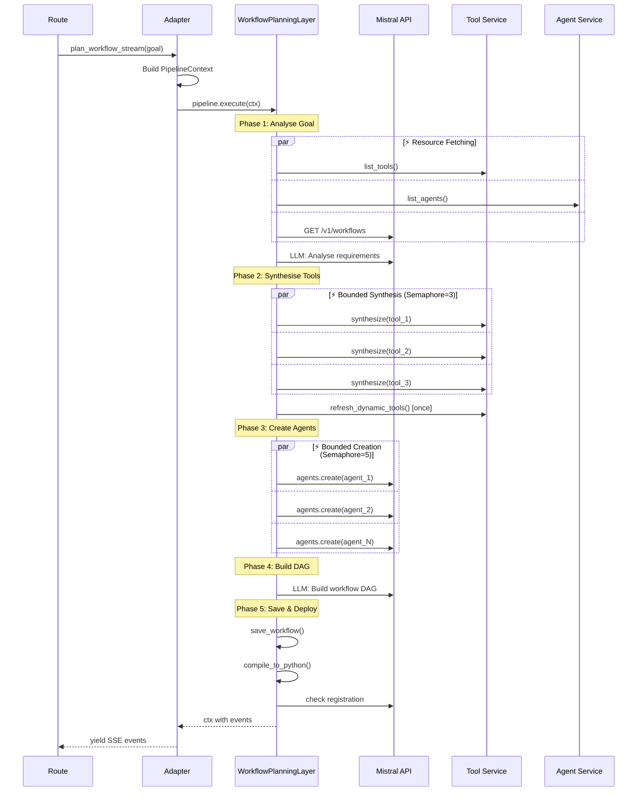
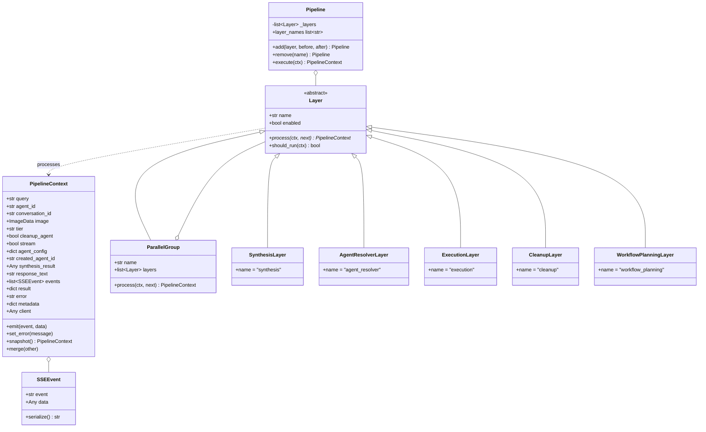
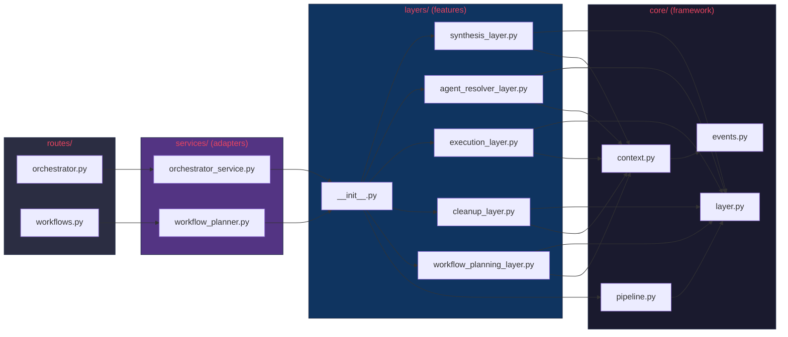

# Architecture — Layered Pipeline with Parallelism

## System Overview



---

## Chat Pipeline — Detailed Flow



---

## Workflow Pipeline — Internal Parallelism



---

## Core Framework — Class Hierarchy



---

## Before vs After

````carousel
### Before — Monolithic

```
orchestrator_service.py  (717 lines)
├── _parse_agent_config()
├── _sse()
├── _build_user_inputs()
├── _check_synthesis_needed()      ← LLM call
├── orchestrate()
│   ├── _handle_followup()
│   ├── _handle_existing_agent()
│   └── _handle_new_query()
│       ├── _check_synthesis_needed()   ← sequential
│       ├── _analyze_query()            ← sequential  
│       ├── _create_dynamic_agent()     ← sequential
│       └── _process_tool_calls()       ← sequential loop
├── orchestrate_stream()
│   └── _consume_stream_and_tools()     ← sequential tools
├── _extract_response()
└── _extract_stream_chunk()

workflow_planner.py      (370 lines)
├── Phase 1: fetch tools, agents, workflows  ← sequential
├── Phase 2: synthesize tools                ← sequential loop
├── Phase 3: create agents                   ← sequential loop
├── Phase 4: build DAG
└── Phase 5: save & deploy
```

> [!WARNING]
> Every LLM call and I/O operation runs sequentially, even when independent.
<!-- slide -->
### After — Pipeline with Parallelism

```
core/
├── context.py      PipelineContext (snapshot + merge)
├── layer.py        Layer ABC + ParallelGroup
├── pipeline.py     Middleware-style executor
└── events.py       Typed SSEEvent

layers/
├── __init__.py     Pipeline assembly
├── synthesis_layer.py          ─┐
├── agent_resolver_layer.py     ─┤ ⚡ ParallelGroup
├── execution_layer.py           │  ⚡ gather(tool_calls)
├── cleanup_layer.py             │  try/finally wrapper
└── workflow_planning_layer.py   │  ⚡ Phases 1-3 parallel
                                 
services/
├── orchestrator_service.py   (~120 lines — thin adapter)
└── workflow_planner.py       (~45 lines — thin adapter)
```

> [!TIP]
> Adding a new feature = 1 file + 1 line registration. No existing files touched.
````

---

## File Map


