# Architecture — Mistral Dynamic Agent Tools

> **Scope.** This document describes the system as it exists in the repository: its
> deployable units, the boundaries between them, the runtime flows that cross those
> boundaries, and the design constraints that follow. It is a description of the
> built system, not a roadmap.

---

## 1. What the system does

The platform turns a natural-language request into a *running* AI capability. Three
things are created on demand rather than being written by hand ahead of time:

| Created on demand | By whom | Persisted as |
|---|---|---|
| **Tools** — Python functions | Codestral, via a synthesis pipeline | Source file + DB row in the Tool Service |
| **Agents** — Mistral agents with instructions, model, tool bindings | `mistral-large` acting as an orchestrator | Remote objects on the Mistral platform |
| **Workflows** — multi-agent DAGs | A 5-phase planner, **or** the visual builder | DB row + a compiled Mistral Workflows SDK module |

Everything else in the codebase exists to make that loop safe, observable, and
re-entrant.

---

## 2. System context

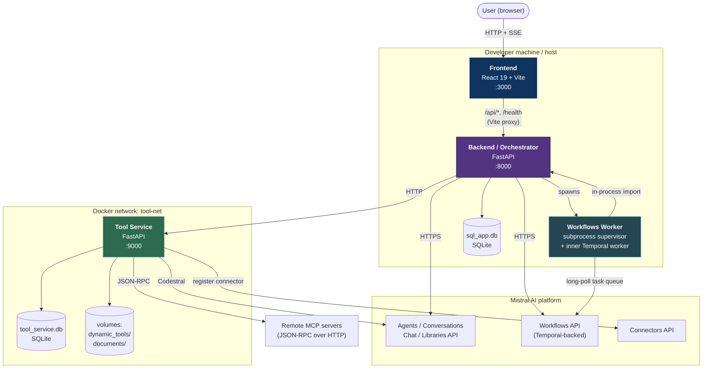

### 2.1 The three deployable units

| Unit | Runtime | Entry point | Port | State it owns |
|---|---|---|---|---|
| **Frontend** | Node / Vite dev server (or static build) | `frontend/src/main.tsx` | 3000 | Client cache (TanStack Query), UI state (Zustand) |
| **Backend** | Python 3.11+, uvicorn | [backend/app/main.py](backend/app/main.py) | 8000 | `workflow_definitions`, `remote_servers`, in-memory execution store, uploads |
| **Tool Service** | Docker container, uvicorn | [tool-service/app/main.py](tool-service/app/main.py) | 9000 | `tools` table, generated `.py` files, MCP registry JSON, generated documents |

The **Workflows Worker** is not a fourth service — it is a subprocess tree that the
backend owns (§6.3).

### 2.2 Why the Tool Service is separate

The split is a **trust boundary**, not a scaling boundary. The Tool Service is the only
component that executes LLM-generated code. Isolating it in a container means:

- generated code cannot reach the backend's Mistral client, its database session, or its
  environment secrets;
- the container can be rebuilt, wiped, or replaced without touching orchestration state;
- the dependency surface available to generated code (`sandbox_requirements.txt`) is
  declared separately from the service's own dependencies.

The backend never imports or executes generated code. It only speaks HTTP to the
Tool Service through a single client class, `ToolResolver`
([backend/app/services/tool_resolver.py](backend/app/services/tool_resolver.py)).

---

## 3. Backend internal structure

The backend is layered strictly: routes are thin, services are adapters, and all
orchestration logic lives in composable **pipeline layers**.

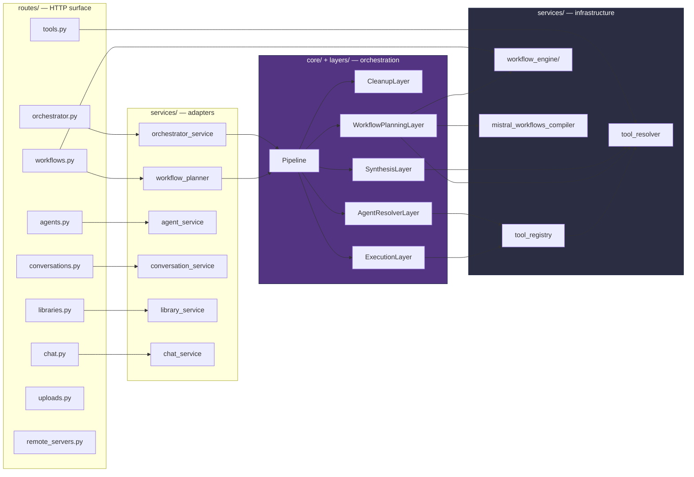

### 3.1 The pipeline framework

Four small modules under [backend/app/core/](backend/app/core/) define the whole
orchestration model.

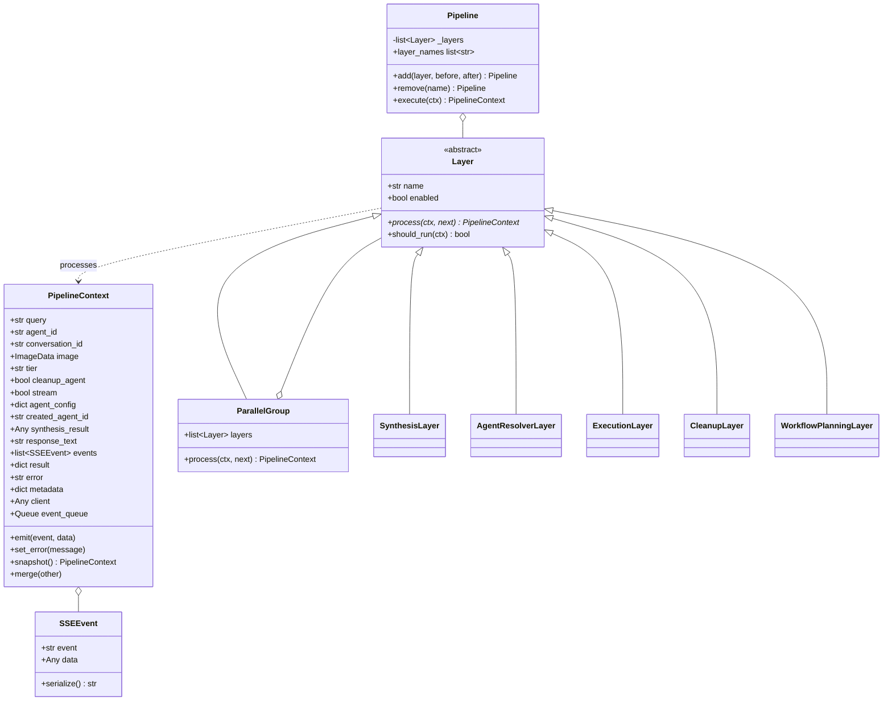

**`PipelineContext`** is a mutable dataclass carrying request input, accumulated state,
and output. It is the only thing passed between layers — there are no other shared
globals in the request path.

**`Layer`** is middleware. Each layer receives `(ctx, next)` and may pre-process,
short-circuit by not calling `next`, or post-process after `next` returns. `should_run`
lets a layer opt out entirely for a given request.

**`Pipeline.execute`** builds the middleware chain from the inside out and invokes it —
the classic onion. `add(layer, before=…, after=…)` gives positional registration.

**`ParallelGroup`** is a `Layer` that runs child layers under `asyncio.gather`, giving
each a `ctx.snapshot()` (own `events` list and `metadata` dict) and merging results back
in deterministic order. It exists in the framework but **is not used by either assembled
pipeline** — see §3.2.

### 3.2 The two assembled pipelines

Defined in [backend/app/layers/\_\_init\_\_.py](backend/app/layers/__init__.py):

```
chat_pipeline      = Cleanup → Synthesis → AgentResolver → Execution
workflow_pipeline  = WorkflowPlanning
```

Both are **sequential at the layer level**. This is deliberate and the file documents
why: `SynthesisLayer` mutates the tool registry, and `AgentResolverLayer` reads it when
choosing tools for the new agent. Running them concurrently would race.

Concurrency instead lives *inside* layers, where the work is genuinely independent:

| Location | What runs concurrently | Bound |
|---|---|---|
| `ExecutionLayer._process_tool_calls_parallel` | all tool calls within one round | unbounded, 5 rounds max |
| `_consume_stream_and_tools` | all buffered tool calls from a stream | unbounded |
| `WorkflowPlanningLayer` phase 1 | list tools / list agents / list workflows | 3-way gather |
| `WorkflowPlanningLayer` phase 2 | tool synthesis | `Semaphore(3)` |
| `WorkflowPlanningLayer` phase 3 | agent creation | `Semaphore(5)` |
| `workflow_engine.execute_workflow` | steps sharing a `parallel_group` | unbounded per group |

---

## 4. Flow: orchestrated chat

The primary user path. `POST /api/orchestrate` (JSON) and `POST /api/orchestrate/stream`
(SSE) share one pipeline; the `ctx.stream` flag selects the branch inside
`ExecutionLayer`.

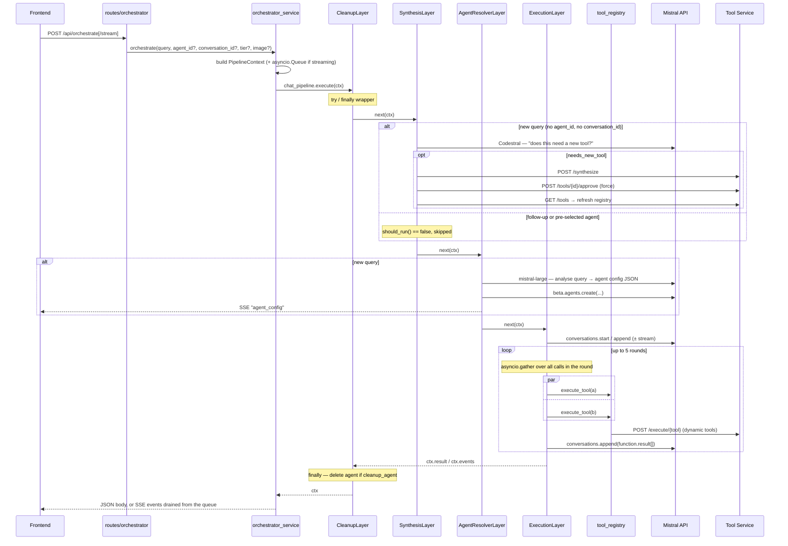

### 4.1 Streaming transport

Streaming does **not** use `EventSource` — the requests are `POST` with a JSON body, so
the frontend implements its own SSE reader over `fetch` +
`ReadableStream` in [frontend/src/api/sse.ts](frontend/src/api/sse.ts).

On the server side, `ctx.emit()` appends to `ctx.events` *and*, when
`ctx.event_queue` is set, pushes to an `asyncio.Queue`. The adapter runs
`pipeline.execute` as a background task and yields from that queue, so progress reaches
the browser as it happens rather than after the pipeline completes. A `None` sentinel
closes the stream; if the client disconnects, the generator's `finally` cancels the task.

### 4.2 Agent tiers

[backend/app/prompts.py](backend/app/prompts.py) encodes a three-tier taxonomy that the
orchestrator and workflow planner both use to decide **reuse vs. create**:

| Tier | Meaning | Reuse policy |
|---|---|---|
| `foundation` | Domain-agnostic safety, routing, quality gates | Always reused; never recreated with a domain-specific name |
| `domain` | Business-domain capability (lending, e-commerce, HR) | Reused across product types within the domain |
| `use_case` | Product-specific | Created per product type |

This is the main lever against unbounded agent proliferation, and it is enforced by
prompt engineering rather than by code.

---

## 5. Flow: tool lifecycle

### 5.1 Synthesis — six stages

[tool-service/app/services/synthesis_service.py](tool-service/app/services/synthesis_service.py)

```mermaid
graph TB
    IN["POST /synthesize<br/>{name, description, parameters,<br/>required, api_details, output_shape}"]
    HASH{"SHA-256 of schema<br/>already in DB?"}
    S1["<b>1</b> Build structured Codestral prompt"]
    S2["<b>2</b> Codestral generates Python"]
    S3["<b>3</b> Static analysis<br/>ruff format → AST parse →<br/>import whitelist → 'run' exists → ruff check"]
    S3A{"passed?"}
    HEAL["<b>3a</b> Self-heal:<br/>append error to message history,<br/>regenerate (≤3 attempts)"]
    S4["<b>4</b> Sandbox: subprocess, 10 s timeout,<br/>minimal env, auto-generated test inputs"]
    S4A{"passed?"}
    HEAL2["Self-heal with runtime error<br/>(≤3 attempts, re-runs stage 3)"]
    S5{"<b>5</b> AUTO_APPROVE?"}
    PEND["status = pending_approval<br/>(code stored, not on disk)"]
    S6["<b>6</b> Write dynamic_tools/{name}_{hash8}.py<br/>import it, cache module.run<br/>status = approved"]
    FAIL["status = failed"]

    IN --> HASH
    HASH -->|yes| RET["return existing record"]
    HASH -->|no| S1 --> S2 --> S3 --> S3A
    S3A -->|no| HEAL --> S3
    S3A -->|yes| S4 --> S4A
    S4A -->|no| HEAL2 --> S4
    S4A -->|yes| S5
    S3A -.->|retries exhausted| FAIL
    S4A -.->|retries exhausted| FAIL
    S5 -->|yes| S6
    S5 -->|no| PEND
    PEND -.->|POST /tools/{id}/approve| S6

    style S3 fill:#2d6a4f,stroke:#40916c,color:#fff
    style S4 fill:#2d6a4f,stroke:#40916c,color:#fff
    style FAIL fill:#6a040f,stroke:#9d0208,color:#fff
```

Three properties matter architecturally:

- **Content-addressed dedup.** The SHA-256 of `{name, description, parameters}` is the
  unique key. Re-requesting the same tool is a no-op that returns the existing record.
- **The retry loop is conversational.** Failures are appended to the same Codestral
  message history, so the model sees its own prior attempt plus the exact error. This is
  why `messages` is threaded through the whole function rather than rebuilt per attempt.
- **Approval is a state transition, not a queue.** `pending_approval` means the code
  exists in the DB but not on disk and not in the execution cache. `approve_tool` is
  what materialises it.

### 5.2 Execution — three-tier routing

`tool_registry.execute_tool` in
[backend/app/services/tool_registry.py](backend/app/services/tool_registry.py) is the
single dispatch point:

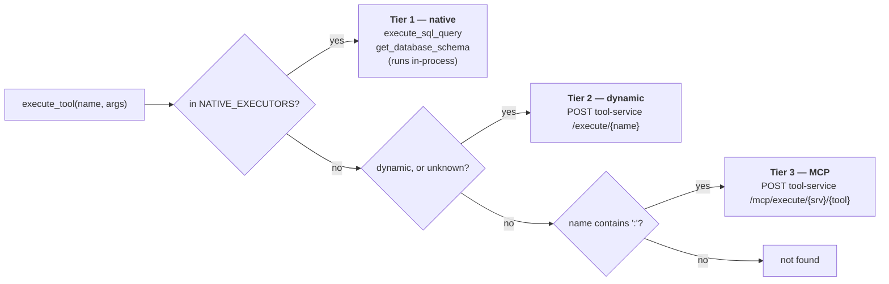

Alongside these, four **Mistral-native capabilities** (`web_search`, `code_interpreter`,
`image_generation`, `document_library`) are declared in `BUILTIN_TOOLS` and passed
straight through to the agent definition — they execute on Mistral's side and never
reach this router.

`refresh_dynamic_tools()` pulls approved schemas from the Tool Service and mutates the
module-level `ALL_TOOLS` / `AVAILABLE_TOOL_KEYS`. This is process-local mutable state:
it is repopulated at startup and after each synthesis, and it is why the backend is
effectively single-instance today (§10).

### 5.3 Resilience: the LLM fallback

[tool-service/app/services/llm_fallback.py](tool-service/app/services/llm_fallback.py)

When a tool crashes, or returns a value that `_is_error_result` recognises as a soft
failure, the Tool Service calls `mistral-large` with the tool's description, the caller's
arguments, and the error, and asks it to produce the result the tool *should* have
returned. The response is tagged `_fallback: true` and `_original_error`.

This is a deliberate availability-over-accuracy trade: an agent mid-conversation gets a
usable value instead of a dead end. The `_fallback` flag is the contract that lets
downstream consumers distinguish synthesised data from real data — anything that treats
tool output as authoritative must check it.

### 5.4 Publishing to MCP

Two distinct outbound paths exist, and they are not the same mechanism:

| Path | Owner | Contract | Purpose |
|---|---|---|---|
| `POST /tools/{id}/publish-mcp` | Tool Service | `POST {server}/deploy` + Mistral Connectors API | Full publish: deploy code, register + activate an org-wide Mistral connector, re-discover tools |
| `POST /api/remote-servers/{id}/send-tool` | Backend | `POST {url}` with `{name, description, code}` | Lightweight push of source to a user-configured endpoint |

The first makes a tool callable *by Mistral itself* via a connector; the second just
ships source code somewhere.

---

## 6. Flow: workflows

Workflows are the most involved subsystem, because a workflow has **two authoring
paths**, **three representations** and **two execution engines**.

### 6.0 Two authoring paths, one artifact

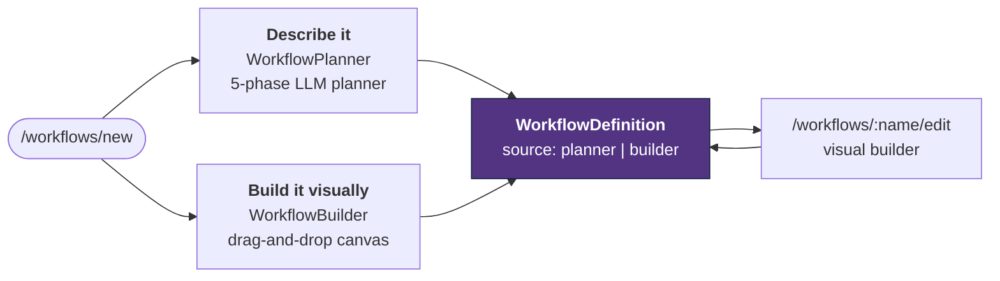

Both paths converge on the same `WorkflowDefinition`, so anything the planner
generates can be reopened and reshaped on the canvas, and anything built by hand
gets the same compilation, registration and execution machinery. `source` records
provenance; it carries no behavioural weight.

The builder adds three fields to the definition, all additive with defaults so
records written before it existed still load:

| Field | Purpose |
|---|---|
| `source` | `planner` or `builder` — provenance only |
| `ui_layout` | `{step_id: {x, y}}` canvas coordinates; ignored by engine and compiler |
| `published_hash` | SHA-256 of the semantic definition at the last successful publish |

`published_hash` is what makes "unpublished changes" derivable rather than
stored. `semantic_hash()` deliberately excludes `ui_layout`, `id`, `is_deployed`
and `archived`, so dragging a node never marks a workflow dirty, while editing a
prompt does. `has_unpublished_changes` is a Pydantic **computed field**, so it
rides along in every response without each endpoint remembering it.

**Save and publish are separate.** Saving stores the definition; publishing
compiles it, writes the module the worker loads, and registers it on Mistral.
Until you publish, the live version keeps serving.

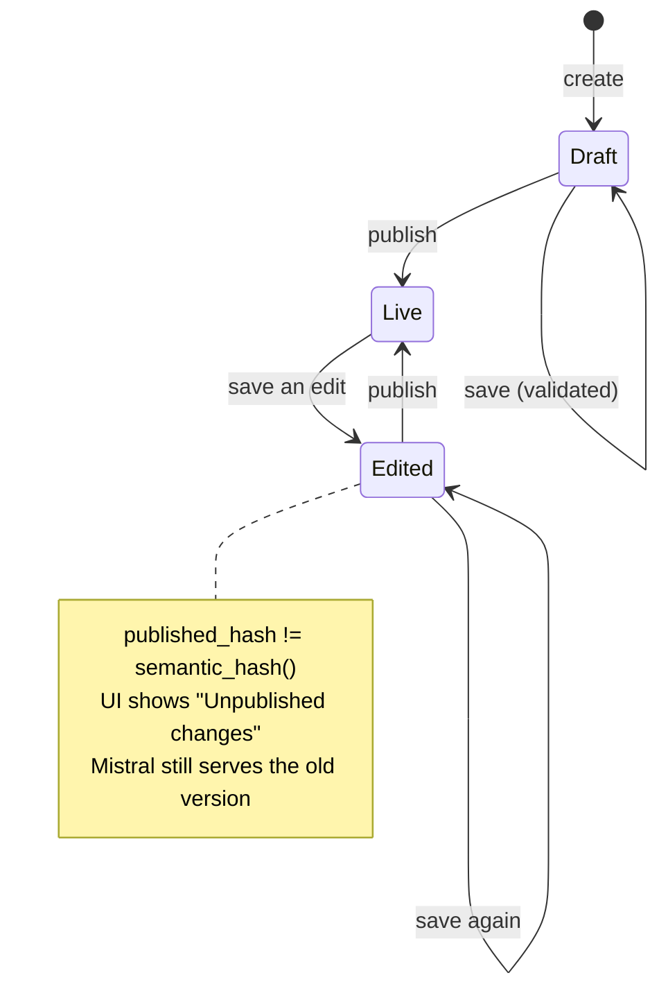

Every write path runs `validate_workflow` first; error-severity issues return
422 and nothing is persisted. The same checks run continuously in the builder
(debounced, advisory) so problems surface while editing rather than on save.
Checks cover dangling edges, cycles, unreachable steps, missing bindings,
malformed identifiers, and parallel groups whose branches disagree about where
they rejoin. Reachability understands parallel groups — the engine enters *all*
members when it lands on any one — so fan-out branches are not falsely flagged.

### 6.1 The three representations

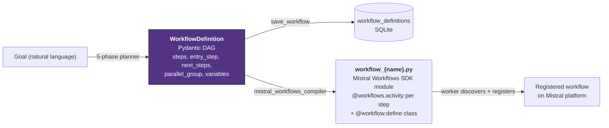

The compiled module is not a translation of the logic — it is a **thin shell**. Each
generated activity re-imports `run_step` from the backend and hands it the serialised
step definition. The DAG semantics live in exactly one place
([step_runners.py](backend/app/services/workflow_engine/step_runners.py)) regardless of
which engine runs it.

### 6.2 Planning — five phases

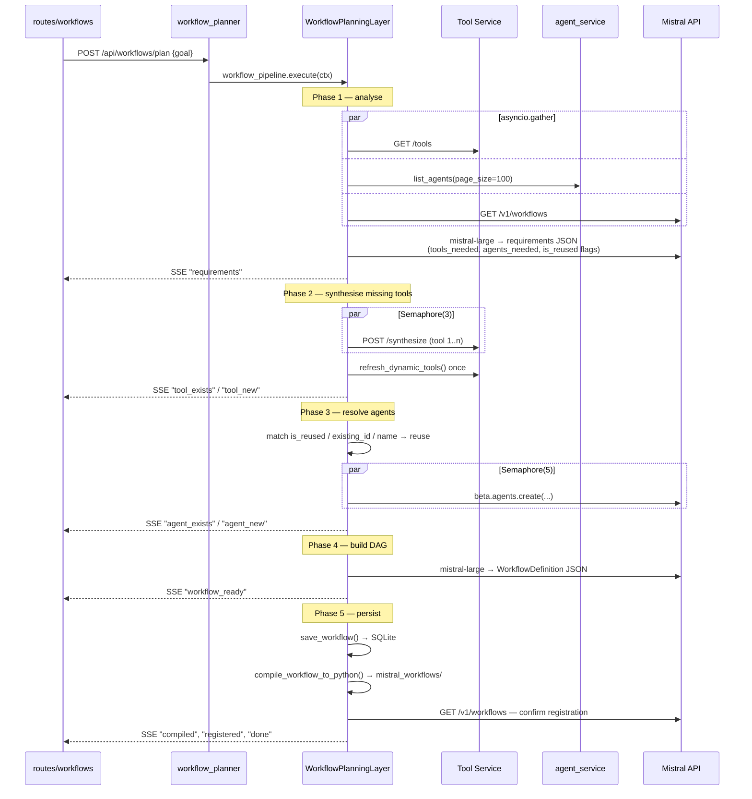

Phases 2 and 3 fail **fatally** — a `fatal_error` event returns immediately rather than
producing a workflow with missing pieces. Phase 5's registration check is
non-fatal: the file lands on disk and the worker picks it up asynchronously.

### 6.3 The worker: why it is a subprocess tree

This is the least obvious design in the codebase, and it is forced by an SDK constraint
documented at length in
[backend/app/services/mistral_worker.py](backend/app/services/mistral_worker.py).

`@workflows.activity()` registers into a **global registry inside the Mistral/Temporal
SDK** at decoration time — that is, at module import. Re-importing a changed workflow
module in the same process registers its activities a second time, and Temporal raises
`More than one activity named …`. No amount of `sys.modules` manipulation clears it,
because the duplicate lives inside the SDK, not in Python's module cache.

The answer is process-level isolation:

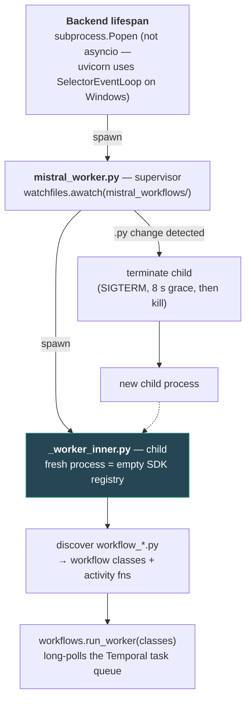

A second constraint compounds it. The SDK's config is a **frozen singleton built at
import time**, and the Temporal task queue is a *nested* config field. If the queue the
worker polls differs from the deployment name the server dispatches to, executions hang
in `RUNNING` forever. So `_worker_inner.py` sets its environment *before the first
`mistralai.workflows` import*:

```
MISTRAL_WORKER__TEMPORAL__TASK_QUEUE          = <deployment>   # nested — the one that matters
MISTRAL_WORKER_DEPLOYMENT_NAME                = <deployment>
MISTRAL_WORKER__WORKER__ENABLE_CONFIG_DISCOVERY = false        # else the server overwrites it
```

Disabling config discovery is load-bearing: the SDK otherwise contacts
`wf-scheduler.mistral.ai` and overwrites the task queue with the server's default.

### 6.4 Execution — dual engine

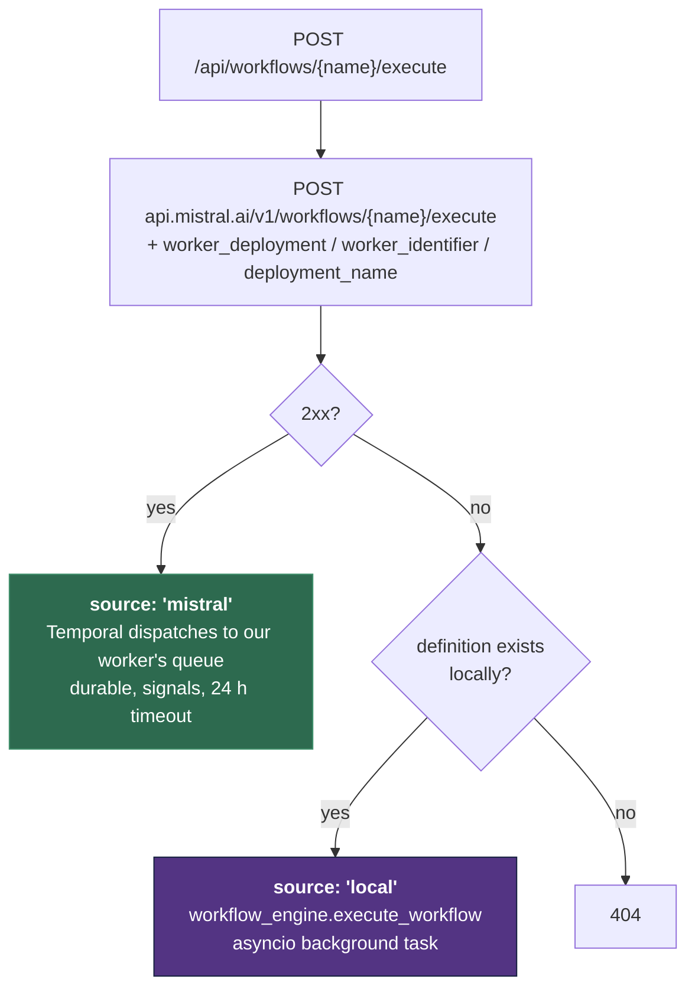

The remote path is attempted **unconditionally**, not gated on `is_deployed` — the flag
is informational. Status reads (`GET /workflows/executions/{id}` and its `/stream`
variant) apply the same order: Mistral first, local store as fallback.

The local engine walks the DAG iteratively with a `visited` set, a 50-step safety cap,
and cycle detection. Steps sharing a `parallel_group` are gathered concurrently; each
branch receives `dict(run.variables)` — a snapshot — and outputs are merged back after
the group completes, which is what keeps concurrent branches from clobbering each other.

Four step types are dispatched by `run_step`:

| Type | Behaviour |
|---|---|
| `agent` | Resolve `agent_id` (name → UUID, cached), substitute `{{vars}}` into the query template, run up to 10 tool-call rounds |
| `tool` | Call the Tool Service directly |
| `condition` | Evaluate an expression; its output's `next_step` overrides normal edge traversal |
| `transform` | Run a transform expression over the variable store |

---

## 7. Data architecture

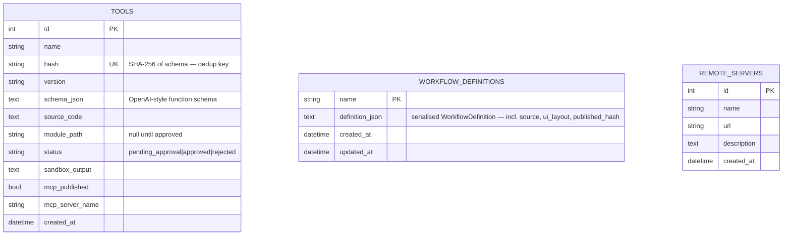

### 7.1 Where state actually lives

| State | Store | Durability |
|---|---|---|
| Tool records | Tool Service SQLite (`tool-db` volume) | Durable |
| Generated `.py` files | Tool Service `dynamic_tools/` volume | Durable |
| Generated documents | Tool Service `documents/` volume | Durable |
| Workflow definitions | Backend SQLite | Durable |
| Remote server configs | Backend SQLite | Durable |
| MCP server registry | JSON file in the Tool Service | Durable, but file-based |
| Compiled workflow modules | `mistral_workflows/*.py` on the host | Durable |
| **Local workflow executions** | `_execution_store` — in-memory dict | **Lost on restart** |
| Tool execution cache | `_execution_cache` — in-memory dict | Rebuilt by `warm_cache` at startup |
| Dynamic tool schemas | `ALL_TOOLS` module global | Rebuilt by `refresh_dynamic_tools` |
| Agents, conversations, libraries | Mistral platform | Remote |

The backend uses **two SQLAlchemy declarative bases against the same database file** —
`app.database.Base` (remote servers) and a private `_Base` inside
[workflow_engine/engine.py](backend/app/services/workflow_engine/engine.py) (workflow
definitions). They are created independently at import/startup.

The Tool Service applies **hand-rolled additive migrations** in `init_db()`
(`_migrate_add_column` does a `SELECT` probe, then `ALTER TABLE` on failure). There is no
migration framework in either service.

---

## 8. Frontend architecture

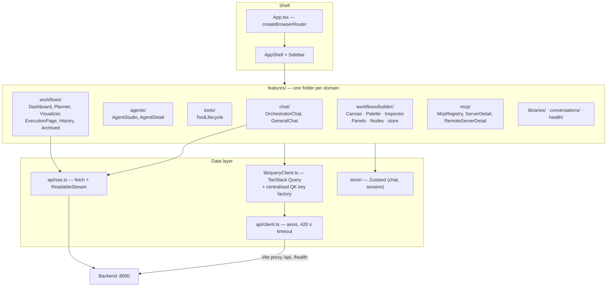

Two conventions carry most of the weight:

- **`QK`** in [frontend/src/lib/queryClient.ts](frontend/src/lib/queryClient.ts) is a
  single factory for every query key in the app. Cache invalidation after a mutation is
  therefore a lookup, not a string that has to match by convention.
- **Request/stream split.** Anything with a request/response shape goes through axios and
  TanStack Query; anything that streams progress bypasses both and uses the custom SSE
  reader. The two never share a code path.

The workflow visualiser renders DAGs with `@xyflow/react` and lays them out with `dagre`.

### 8.1 The visual builder

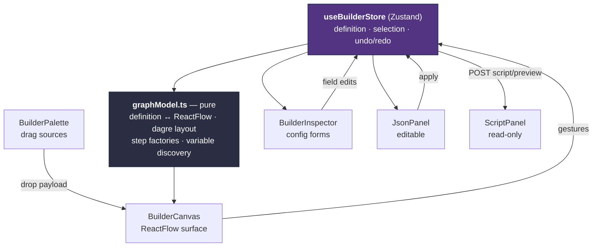

Three properties do the work:

- **The store is the only authority.** The canvas, inspector, JSON and script
  views are all projections of one `WorkflowDefinition`. No view holds state the
  others cannot see, which is why they cannot drift apart.
- **`graphModel.ts` is pure.** No React, no store access — just definition ↔
  ReactFlow mapping, dagre layout, step factories and graph mutations that return
  new arrays. The mapping is testable in isolation.
- **The asymmetry between JSON and script is deliberate.** JSON is editable and
  writes back; the script is generated and read-only. Making the Python editable
  would mean maintaining a parser for it and would let the two representations
  disagree about what the workflow is.

Node drags are excluded from the undo stack — dragging emits a position update
per frame, and recording those would make undo useless. `commitLayout` closes the
gesture once on drag end.

Agents and tools can be created without leaving the canvas: the palette's inline
modals call the existing `POST /api/agents` and `POST /api/tools/synthesize`
endpoints and refetch the catalog, so a missing piece never costs the user the
graph they were building.

### 8.2 Tools attach to agents, not to steps

**A tool cannot be a workflow step.** `run_agent_step` passes only `agent_id` to
`client.agents.complete`; the tools the model may call come from the *agent's own
definition on Mistral*. Nothing in a workflow step can grant an agent a
capability. So the builder treats tools as a property of an agent:

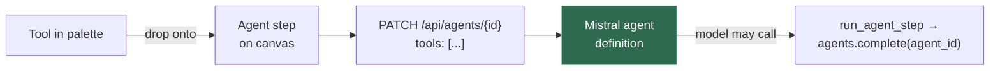

Consequences the UI has to be honest about:

- **Dropping a tool on empty canvas is refused**, with an explanation rather than
  a silently ignored gesture. During the drag, valid agent targets highlight —
  which needs a second, payload-free MIME type, because `dataTransfer.getData()`
  returns `""` during `dragover` and only `types` is readable.
- **Attaching writes through to Mistral immediately.** There is nowhere else to
  put it; the definition has no field that could carry it.
- **It edits the agent globally.** The inspector says so, because the same agent
  may be used by other workflows.
- **Agent nodes read their tool list from the catalog**, never from step config —
  the catalog is the only thing that reflects what the model will actually see.

Legacy `tool` steps from planner-authored definitions still render, execute and
remain editable, so existing workflows keep working. They carry a `direct call`
badge and a `tool.standalone_step` validation warning explaining that the tool
runs with hand-written arguments and no agent reasoning about the call.

---

## 9. Cross-cutting concerns

### 9.1 Configuration

Both services use `pydantic-settings` with a `.env` file and `extra = "ignore"`. The
backend additionally exposes `map_model_name()`, which translates UI-facing aliases
(`default-large-latest`) to real Mistral model IDs — an anti-corruption shim at the
boundary so alias drift never reaches the API client.

### 9.2 Error handling

The backend registers six typed exception handlers in `main.py` (`MistralAPIError`,
`AgentNotFoundError`, `ConversationNotFoundError`, `ToolServiceError`, `WorkflowError`,
plus a catch-all). Layers are deliberately **failure-tolerant rather than
failure-propagating**:

- `SynthesisLayer` swallows every exception and sets `synthesis_result = False` — a
  failed tool synthesis degrades the answer, it does not fail the request.
- `AgentResolverLayer` falls back to a hard-coded General Assistant config if analysis
  fails, and synthesises a full instruction block if the LLM returns fewer than 50
  characters.
- `ParallelGroup` logs and drops a failed branch rather than failing the group.
- `CleanupLayer` uses `try/finally`, so agent deletion runs even on error paths.

### 9.3 The security model for generated code

Defence is layered, and each layer is worth naming precisely:

| Control | Where | What it actually stops |
|---|---|---|
| Import whitelist (AST) | `_static_analyse` | `import os`, `subprocess`, `socket`, `ctypes`, `threading`, … and any package not in the allow-list |
| `run` function required | `_static_analyse` | Modules with no callable entry point |
| `ruff check` (E, F) | `_static_analyse` | Undefined names, syntax-adjacent errors |
| Sandbox subprocess | `run_in_sandbox` | Runaway execution — 10 s timeout, `cwd=/tmp`, `env` reduced to `PATH` only (no secrets inherited) |
| Container isolation | Docker | Reach into the backend's process, secrets, or database |
| Approval gate | `AUTO_APPROVE_DYNAMIC_TOOLS` | Code reaching disk and the execution cache |

Note that the import check is **static and AST-based** — it inspects `Import` and
`ImportFrom` nodes. Dynamic import via `__import__` or `getattr` is not covered by it;
the container boundary and the stripped sandbox environment are what bound the blast
radius in that case.

Two facts about the approval gate are worth stating plainly, because they change its
meaning:

- `tool-service/.env.example` ships `AUTO_APPROVE_DYNAMIC_TOOLS=false`, but
  `ToolResolver.trigger_synthesis` **force-approves** any tool that comes back
  `pending_approval`, explicitly so synthesis never blocks the chat pipeline. On the
  backend-driven path the gate is therefore open regardless of the Tool Service setting.
  It still holds for tools synthesised by calling the Tool Service directly.
- The `Dockerfile` creates `sandboxuser` and gives it ownership of the writable
  directories, but no `USER` directive is issued and `run_in_sandbox` does not drop
  privileges — the sandbox subprocess inherits the container's user.

### 9.4 Observability

Structured `logging` throughout, with the noisy Mistral/Temporal SDK loggers explicitly
raised to `WARNING`/`CRITICAL` in `main.py` because they emit self-recovering tracebacks
during normal operation. `GET /health` on the backend reports its own status plus
Tool Service reachability; the frontend surfaces this in the Health dashboard.

---

## 10. Architectural constraints and known gaps

Stated as facts about the current code, not as a backlog.

**Single-instance backend.** `ALL_TOOLS`, `_dynamic_tool_schemas`, `_execution_store`,
and the agent-name→UUID cache are module-level process state. Two backend replicas would
diverge: a tool synthesised on replica A is invisible to replica B until its next
refresh, and workflow executions started on A are unreadable from B. Horizontal scaling
requires moving all four into a shared store.

**Local workflow executions are ephemeral.** `_execution_store` is a plain dict. A
backend restart loses in-flight and completed local run history. Executions routed to the
Mistral platform are durable; only the local-engine fallback has this property.

**Tier-3 MCP routing in `tool_registry.execute_tool` is unreachable.** The tier-2
condition is `tool_name in _dynamic_tool_schemas or tool_name not in ALL_TOOLS`. A
`server:tool` name is not in `ALL_TOOLS`, so it matches tier 2 and is proxied to
`/execute/{name}` before the `":" in tool_name` check is ever evaluated. MCP tools invoked
through this router will not reach the MCP path. The Tool Service's own
`/mcp/execute/{server}/{tool}` endpoint and `ToolResolver.execute_mcp_tool` work
correctly — it is only this dispatch ordering that is wrong.

**`ParallelGroup` is implemented but unused.** Both assembled pipelines are sequential.
The class is tested by neither pipeline in production use; parallelism in the request path
comes from `asyncio.gather` calls inside individual layers.

**No migration framework.** Schema evolution in the Tool Service is a hand-rolled
`SELECT`-probe-then-`ALTER TABLE`. The backend relies on `create_all`, which adds tables
but never alters existing ones.

**Tool-call rounds are capped and unbounded in width.** Depth is limited (5 rounds in
`ExecutionLayer`, 10 in `run_agent_step`), but the number of concurrent tool calls within
a round is not — a model that requests fifty tools produces fifty simultaneous HTTP calls
to the Tool Service.

**The `_fallback` flag is advisory.** `llm_fallback` returns plausible synthesised data
on tool failure. Any consumer that treats tool output as ground truth must check
`_fallback`; nothing in the type system enforces that.

---

## 11. Extension points

The system is designed to be extended at four seams, in rough order of how often they are
used:

| To add… | Do this | Files touched |
|---|---|---|
| A pipeline capability (caching, rate limiting, tracing, guardrails) | Subclass `Layer`, register in `layers/__init__.py` with `before=`/`after=` | 1 new file + 1 line |
| A native tool | Add to `FUNCTION_TOOLS` and `NATIVE_EXECUTORS` | `tool_registry.py` |
| A dynamic tool | Nothing — describe it in a query and let synthesis run | — |
| A workflow step type | Add to `StepType`, write a runner, register in `run_step`'s dispatch, teach the compiler, add a node + inspector form | `models.py`, `step_runners.py`, `mistral_workflows_compiler.py`, `graphModel.ts`, `BuilderNodes.tsx`, `BuilderInspector.tsx` |
| A capability for an agent | Attach a tool to the agent — drop it on the agent node, or tick it at creation. Never a step | — |
| A workflow validation rule | Write a check returning `ValidationIssue`s with a new stable `code` | `workflow_engine/validation.py` |
| An MCP server | `POST /api/mcp/servers` — handshake and discovery are automatic | — |

The first row is the important one. Adding a layer requires no changes to any existing
layer, to the adapters, or to the routes — which is the property the pipeline refactor
was built to obtain.
